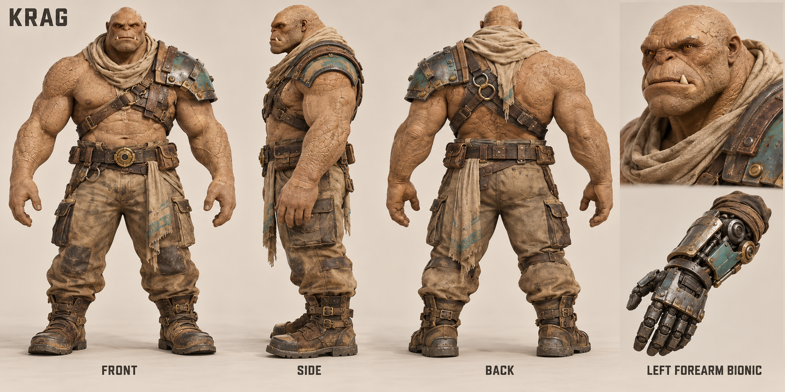
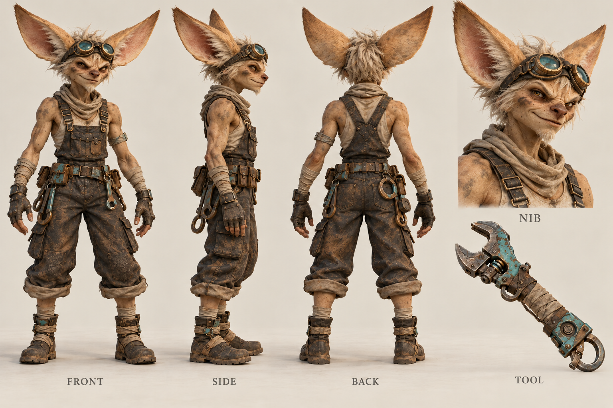
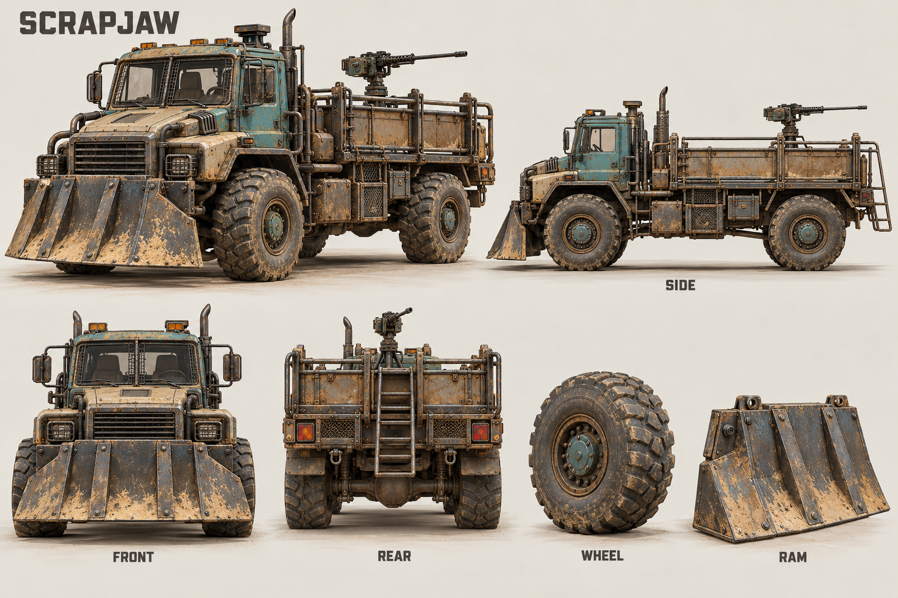
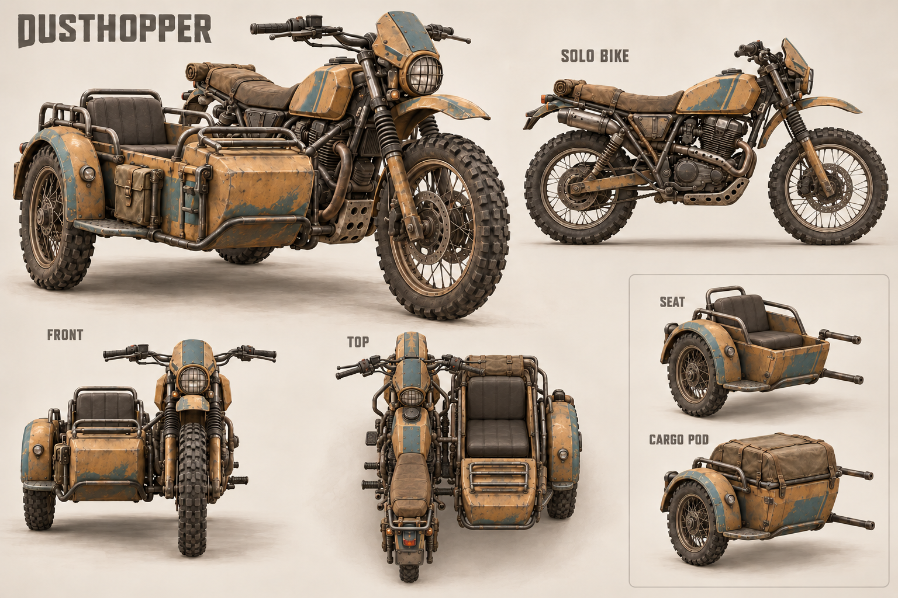
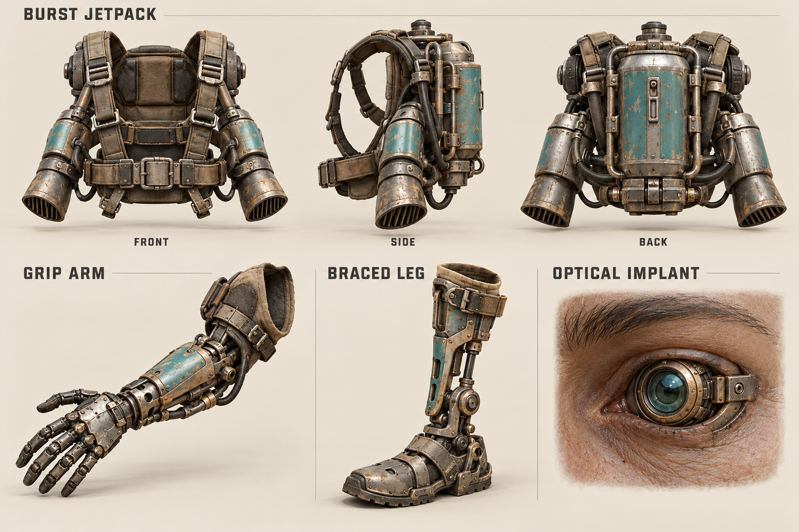
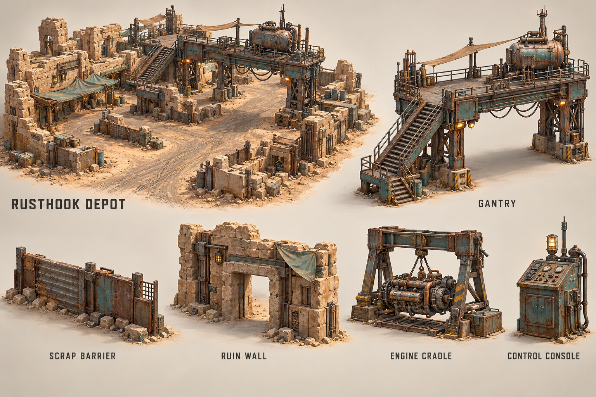
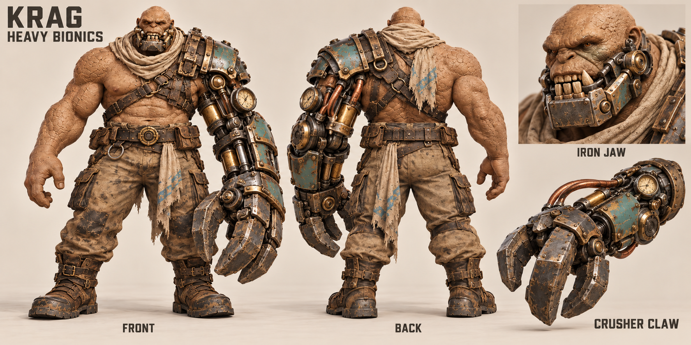
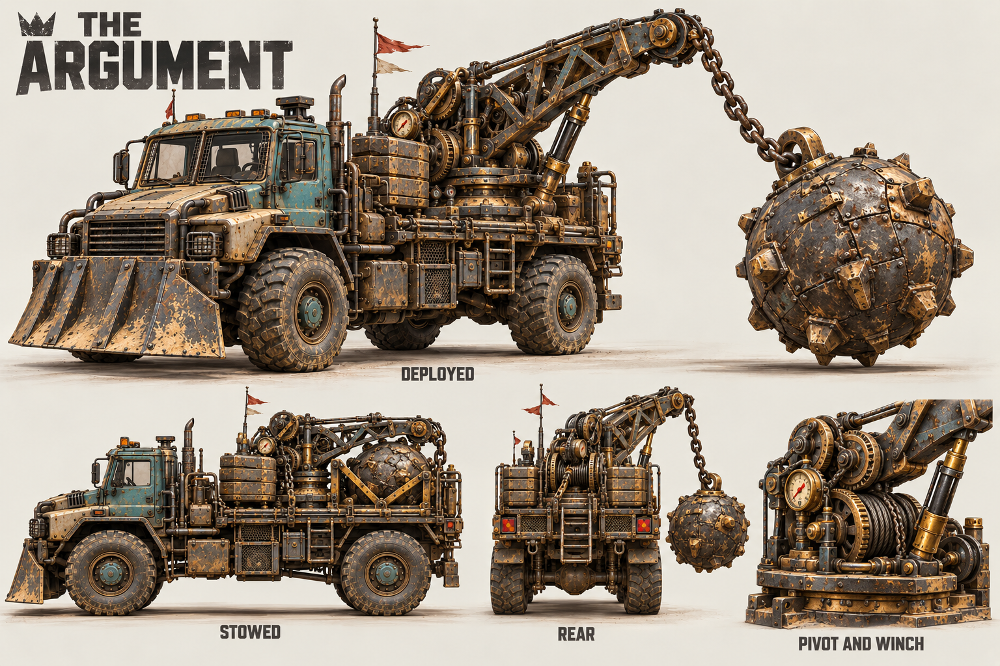
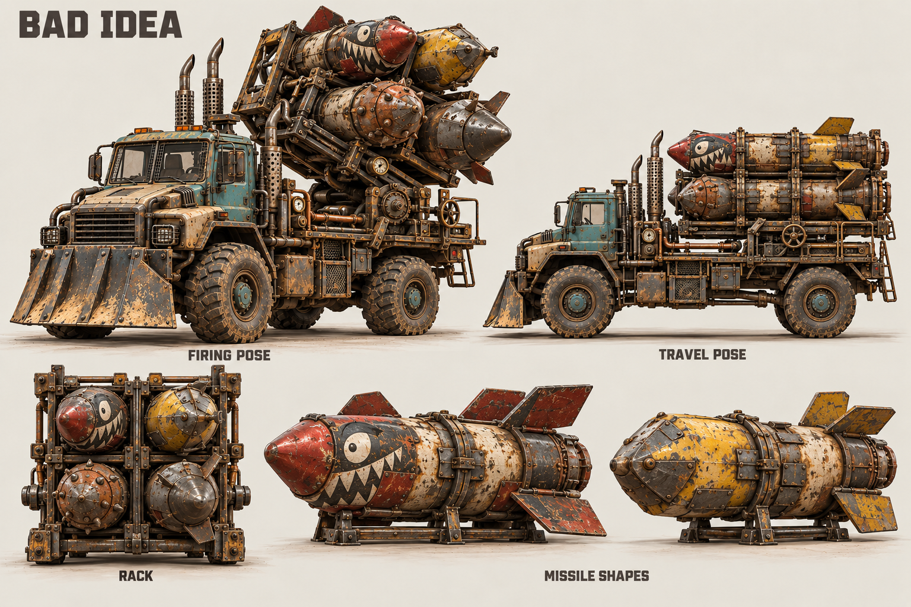
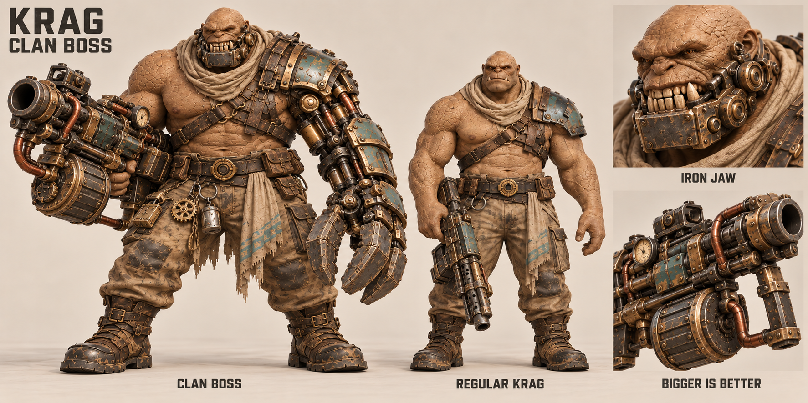

# Concept art and future 3D model briefs

Draft 0.5 · 4 October 2026 · [Pack overview](00-overview-and-campaign.md)

**Production update — 5 October 2026:** the ten original sheets remain the character/vehicle/material references. [16 — character and merchandise production](16-character-and-merch-production.md) adds the current quality gates, minimal Krag versus richer Nib clothing, tattoos, visible armor and complete-limb requirements. Final models are mandatory for the investor POC. New strategic explorations are in [18](18-strategic-concept-art.md); they do not change the original character masters or finalize the story.

Ten concept sheets accompany this pack. They were created with the built-in image generator for this project. They are visual development references, not finished 3D meshes or exact orthographic blueprints. Use the written scale, handedness, attachment and collision requirements below when a generated view leaves mechanical detail ambiguous.

Internal movement tests may use primitives, but the currently requested investor engine demos require detailed concept-faithful characters. Primitive tests do not satisfy their art acceptance.

## 1. Shared visual direction

Semi-realistic textured characters and assembled machinery, readable from an elevated tactical camera. Use pale sandstone skin/stone, dusty canvas, worn steel, rust and restrained faded teal panels. Prioritise silhouette, material contrast and functional access over small ornamental detail.

**Revision 0.2:** the original base sheets were deliberately practical and landed too restrained for the intended game. The three new heavy-bionic, demolition and missile sheets set the desired level of mechanical exaggeration. Keep the material treatment, but push oversized forms, exposed pistons, brass gauges, copper lines, uneven metal teeth and swagger. Semi-realistic rendering does not require realistic proportions or sensible engineering. Painted faces, homemade pennants and theatrical vents can add character while each mechanism remains readable.

**Revision 0.3:** Krags' tough skin, low pain response, fearlessness and delight in fighting inform body materials, expressions and animation. Their enthusiasm for ever-bigger guns drives weapon silhouettes. The clan boss has a visibly larger body, shown beside a regular Krag in the new comparison sheet. These traits also have gameplay rules in files 02, 05 and 06.

Wounds, implants, external passengers, damaged wheels and empty stations must be visible at gameplay distance. Avoid copied faction symbols, signature silhouettes or language from the inspiration franchises. The new designs need their own identity.

Original anatomy remains visible under equipment. A Krag is broad and heavy, with a low head and small tusks. A Nib is a compact adult desert creature with large fennec-like ears, a wiry frame and practical mechanical gear. The selected Nib sheet is the current facial-likeness target; preserve its mature creature face, sandy skin and large ears. Unshown anatomy remains subject to review.

**Confirmed acting update — 5 October 2026:** preserve the selected character sheets' likeness in detailed 3D and expressive animation. Krags are serious brute force, fearless and low-pain, loving big guns and smashing skulls; show heavy foot contacts and forceful combat satisfaction without playful tongue-out clowning. Nibs are playful engineers, physically weak and a little cowardly, as well as stealthy, light-footed and nimble. Their expression range includes cautious glances and flinching alongside cheekiness and sticking out a **dark blue tongue**. Both need credible facial rigs and muscle-aware body deformation for actions, close-ups and future cutscenes. Develop unseen mouth interiors and expression sheets provisionally for review; do not treat an unreviewed interior design as final canon.

**Revision 0.4:** keep the ten selected sheets as references while applying species-specific bionic limits. Heavy claws, the iron jaw and Brok's reinforced piston leg are Krag fittings. Nib alternatives need deliberately lightweight construction, not a uniformly shrunken Krag mechanism. A normal restorative Nib limb restores function without implying heavy combat ability. Krags should appear comfortable or pleased about replacement parts; recovery poses still communicate a body not yet ready for deployment.

## 2. Concept sheet register

| Sheet | Main reference use | Modelling priority |
| --- | --- | --- |
| [01-krag-character-sheet.png](concept-art/01-krag-character-sheet.png) | Front/side/back body, clothing, portrait and arm-replacement idea | Base body, skeleton, anatomical sockets |
| [02-nib-character-sheet.png](concept-art/02-nib-character-sheet.png) | Front/side/back, adult creature face, ears, mechanic equipment | Distinct proportions, ears and driver fit |
| [03-scrapjaw-truck-sheet.png](concept-art/03-scrapjaw-truck-sheet.png) | Heavy truck silhouette, cab, open bed, ram, wheel and rear access | Separate components and usable crew nodes |
| [04-bike-sidecar-sheet.png](concept-art/04-bike-sidecar-sheet.png) | Solo bike, fitted sidecar, top/front view and interchangeable pod | Rider/sidecar positions and assembled footprint |
| [05-jetpack-bionics-sheet.png](concept-art/05-jetpack-bionics-sheet.png) | Harness/back unit, grip arm, braced leg and optical implant | Wearable fit and replacement interfaces |
| [06-rusthook-terrain-kit-sheet.png](concept-art/06-rusthook-terrain-kit-sheet.png) | Depot mood, gantry, cover, ruins, engine cradle and console | Modular collision, traversable surfaces and objective access |
| [07-crusher-claw-and-metal-jaw-sheet.png](concept-art/07-crusher-claw-and-metal-jaw-sheet.png) | Oversized bionic claw, integrated metal jaw, front/back and close details | Arm mounting, pincer pivots, jaw hinge and readable anatomical handedness |
| [08-wrecking-ball-rig-sheet.png](concept-art/08-wrecking-ball-rig-sheet.png) | The Argument, deployed and stowed ball, crane and winch | Continuous attachment chain, sweep, return clearance and travel cradle |
| [09-scrap-missile-rack-sheet.png](concept-art/09-scrap-missile-rack-sheet.png) | Bad Idea, raised and travel rack poses, four sockets and missile silhouettes | Gimbal, muzzle nodes, emptied rack states and projectile clearance |
| [10-clan-boss-and-krag-comparison.png](concept-art/10-clan-boss-and-krag-comparison.png) | Larger clan boss beside a regular Krag, heavy gun, claw and jaw details | Body proportions, gun brace, modular loadout and boss-compatible station fit |

### Krag

Preserve the sandstone surface, small tusks and broad proportions. Separate the shoulder plate, scarf, belt props and replacement forearm where this helps reuse. The sheet's standing pose is a reference; rigging requires a clean production A-pose with adequate armpit/hand clearance.

### Nib

Keep exactly one pair of large ears. The refined sheet avoids extra human ears and a childlike human face. Build ear geometry so goggles and head turns do not clip it. Preserve the angular adult face during playful expressions; rig tongue extension/retraction and use the confirmed dark blue tongue color. The spanner is a separate prop, not fused to the hand.

Confirmed fur coverage follows this sheet: fuller ear/head fur, fine facial/body fuzz and visible mottled skin. Keep that identity in both an efficient game groom and a denser Blender cinematic groom. Review motion shimmer, clumping, hairline/skin transitions and ear silhouette; test actual frame time and VRAM on the user's RTX 2060 before accepting runtime density. Full-body fur coverage is not approved.

### Truck

Use four road wheels and two axles, a two-position cab, open rear bed, side rails, a rear ladder and a bolted ram. Keep the final gun pedestal at the forward end of the cargo bed, immediately behind the cab, leaving the rear loading area clear. Its exact placement and rail connections vary slightly in the art and must be reconciled in the greybox.

### Bike and sidecar

The sidecar is on the **rider's right**: viewer-left in the front view, viewer-right in the top view when the bike points upward. The sheet was revised to correct that relationship. Treat the upper hero as a form reference and the written handedness rule as authoritative. The sidecar's seat and cargo pod are alternative modules, not simultaneous occupants of the same space.

### Jetpack and bionics

The jetpack's harness side faces the back of the wearer; the exterior panel faces away. Keep a clear spine attachment, shoulder straps, hip restraint and nozzle clearance. The mechanical arm and leg are replacement parts with proper socket interfaces. The optical implant replaces one eye; it is not a floating lens stuck to the forehead.

The original two arm studies are alternate simple-grip explorations. Use the equipment sheet for a basic grip prosthetic and the new heavy-bionics sheet for Brok's first playable crusher claw. They are different equipment families; do not mix their joints without resolving the mechanical structure in the sculpt.

### Depot kit

Use the diorama for materials and atmosphere. It is not a measured layout of the 120 × 120 m POC map. Widen lanes, turns, stairs and landing spaces to the gameplay requirements rather than tracing the image. The truck route passes beside the approximately 4 m-high POC gantry; do not require the tall truck to fit underneath it.

### Heavy claw and iron jaw

The claw is on the character's anatomical left: viewer-right from the front and viewer-left from the back. Keep a strong elbow/shoulder load brace, articulated pincer fingers and clear closed/open silhouettes. The jaw needs an actual mouth hinge and moving lower teeth. Scarf and cheek details must not prevent its motion. Use the standing body from the original Krag sheet to maintain scale; the oversized machinery is equipment, not a larger species.

### The Argument

The continuous chain, boom and cradle are essential. The art exaggerates the ball differently between views; choose one model diameter from the approved gameplay collider, initially about 1.3 m, and use it in every pose. Do not shrink the ball to fit the travel cradle. This fitting occupies the transport pool and replaces the gun. Build a skeleton/transform hierarchy for crane yaw, boom angle, chain attachment and ball, with an authored swing/recovery clip. A linked rigid-body chain is optional later presentation work.

### Bad Idea

Keep four sockets in a 2 × 2 rack, with projectiles independently hideable after firing. Match the vehicle's scale to the standard truck. A gimbal can change direction/elevation, but validate the legal launch directions against the cab, crew and other attachments. Name each launch socket and keep a valid muzzle clearance volume; never launch a projectile from inside the host chassis. The mismatched nose shapes and painted expressions are a deliberate part of the tone, while loaded count remains visually exact.

### Clan boss and regular Krag

Build the boss with a broader torso, thicker neck and larger limbs as well as greater height. Compare the two bodies on the same floor at the same camera distance. The boss's anatomical left arm carries the optional crusher claw; his right hand holds an oversized gun with an integral recoil brace. The jaw is an optional implant. Gorr uses this larger body in the POC; show only equipment actually present in his selected loadout. The fully equipped concept is one loadout, not mandatory starting inventory.

Author body bounds and seated poses from the approved greybox. Skin texture should communicate toughness while preserving visible wounds. Keep a serious, combative expression and confident stance, with contained satisfaction in powerful equipment. Size does not silently multiply weapon damage or grant extra actions; the gameplay profiles remain authoritative.

## 3. Authoritative initial scale targets

These are proposed modelling/greybox targets, not dimensions measured from the generated sheets.

| Asset | Initial scale target |
| --- | --- |
| Krag | About 2.2 m tall in a neutral standing pose |
| Krag clan boss | About 2.75 m tall, with broader shoulders, thicker neck and larger limbs; same species |
| Nib | About 1.15 m body height, around 1.5 m to ear tips |
| Truck | About 6.8 m long including ram, 3.0 m wide, 3.4 m cab height; highest attachment under 4.3 m |
| Bike | About 2.8 m long and 0.9 m wide, sized for adjustable rider reach |
| Bike with sidecar | About 2.1 m total width; fit a Krag passenger in the sidecar greybox |
| Gantry | Deck about 4 m high; clear landing footprint at least 2 × 2 m |
| Main vehicle lane | At least 8 m clear on straights; broaden corners to the validated truck sweep |
| Regular-Krag doorway | About 1.4 m clear width and 2.6 m height; validate against the regular body |
| Boss-access route | At least one useful objective route with roughly 3 m headroom and width checked against the boss capsule and equipped silhouette |

The truck dimensions above describe the standard fitting. Record separate stowed and deployed bounds for each oversized attachment; the base cab-height limit must not silently clip the crane or raised missile rack. Measure those bounds in the greybox and use them for route/headroom validation. Weapon reach and damage use the explicit gameplay profiles, not whichever view happens to make the machinery look largest.

Validate seated poses for both species and the boss body. The friendly truck's gun station and access route fit Gorr; the ordinary capacity-2 sidecar does not. Nib driving may need an adjustable seat, step and extended controls. Do not resize characters merely to fit a fixed seat. Collider sizes, animation reach and socket positions should come from the approved greybox, not concept-sheet pixel measurements.

## 4. Asset and export contract

Use metres, a consistent scene-facing direction and the conversion rule in the technical document. Store editable source files and export game assets as `.glb` with material textures. A new import must pass an orientation/scale check in the POC scene before replacing a placeholder.

| Asset | Required separate parts or pivots |
| --- | --- |
| Character | Root at ground/feet; articulated skeleton; replaceable forearms/lower legs; head/eye sockets |
| Boss body / heavy gun | Distinct body bounds and station poses; compatible implant sockets; separate gun mesh, hand grip and visible integral brace |
| Truck | Chassis root; each wheel axle pivot; steering wheels; gun yaw/pitch pivots; ram; detachable damage parts |
| Bike | Frame root; front steering pivot; wheel axles; removable sidecar at a stable socket |
| Jetpack | Equipment origin at spine attachment; nozzles/effect anchors; optional straps fitted per species |
| Terrain | Ground-aligned module origin; simple colliders separate from visual mesh; named traversable surfaces |
| Crusher claw / jaw | Pincer and wrist pivots, elbow/shoulder support, jaw hinge, clear opening and closed states |
| Wrecking attachment | Crane yaw, boom pivot, chain anchor, ball centre, stow cradle and authored safe working sector |
| Missile rack | Yaw/pitch pivots, four independent missile meshes, four launch sockets and control-perch node |

Proposed sockets: `hand_l`, `hand_r`, `spine_pack`, `eye_l`, `eye_r`, `forearm_l`, `forearm_r`, `lowerleg_l`, `lowerleg_r`, `jaw`; truck nodes such as `driver`, `gunner`, `rear_ladder`, `rail_l`, `rail_r`, `bed`, `cab_access`, `engine_access`, `crane_operator` and `rack_operator`. Add `crane_pivot`, `ball_anchor`, `ball_stow` and `launch_01` through `launch_04` for the relevant fittings. These names are a development contract, not text to paint on the model.

Use authored metadata to map sockets to gameplay nodes. Do not infer station capacity from how many meshes happen to be children of a model.

## 5. Damage, animation and initial asset budgets

The first vehicle set needs an intact wheel, disabled/missing wheel state, damaged mount, disabled engine cue and a wreck state, plus the ball's stow/deploy/swing poses. The character set needs a healthy variant, wound marker, oversized claw and animated metal jaw. The missile follow-on adds four/two/zero loaded states. More elaborate deformation can follow once those states are playable.

Minimum reusable character clips for the wider POC: idle, walk/run, seated driver, seated passenger, aim/fire, melee, interact/repair, mount/dismount, climb/board, brace, hit/downed and powered-jump take-off/landing, plus expressive facial acting. Internal blocked poses can prove a rule, but the investor demos require polished movement and deformation. Keep logical arrival separate from animation timing; see [16](16-character-and-merch-production.md) for the current facial/muscle contract.

Krag hit reactions express serious irritation or forceful determination without fearful or exaggerated pain reactions. Physical displacement, disabled limbs and downed states must remain unmistakable. Add a serious combat-ready idle and a weighty heavy-gun recoil pose; the larger boss needs proportion-appropriate stance and grip rather than extra attacks. Fearlessness does not remove physical impact animation. Nibs show lighter support and appropriate caution/flinching alongside playful engineering personality.

The earlier browser-oriented 15–30k character triangle and 2K hero texture proposals are superseded for the current Windows comparison. The user prioritizes premium hero characters on limited-unit, turn-based battlefields. Set runtime budgets from measured Unity/Unreal quality, deformation and performance; preserve detailed masters and avoid reducing visible likeness to meet obsolete numbers. Vehicle budgets remain separate future measurements. Keep gameplay colliders simple regardless of render-mesh detail.

Do not bake huge sheet textures or painted labels into game models. Preserve believable surface scale: rust, skin cracks and cloth weave should not change size between nearby assets.

### Brok's injury and return states

Use a consistent anatomical left leg for this narrated/test case: original limb, damaged/limping state, fitted but recovering prosthetic, then ready piston leg. A simple mesh swap and limp/idle state are sufficient; a surgical cutscene is unnecessary. Keep the scar/attachment history visible where appropriate. The completed piston replacement grants Power Step as well as restoring locomotion, with weighty mechanical sound and a visibly stronger stride; it grants no free stomp attack. Distinguish learned and equipment-perk icons in the interface rather than adding imaginary implants to show XP. Nib lightweight parts require separate silhouettes, fitting and motion checks. See file 10 for exact compatibility and downtime.

## 6. Import acceptance

An asset is ready for POC integration when its scale/axes are correct, pivots work, sockets match the reference metadata, material/texture paths resolve, silhouettes remain readable from the tactical camera, and colliders/landing surfaces agree with the visual model.

Test both species in each supported station. Test a gun turning past rails, a jetpack on the spine, a left implant across animation, the sidecar through a width-limited gap and a missing wheel against the final collision state. Check the gantry from the camera above and beneath it.

Compare boss and regular Krag on one floor. Verify boss clearance, cover exposure, ground/jetpack landing footprint where equipped, gun-station access, sidecar rejection, heavy-gun hand/support fit and visible structural wounds. Ensure the larger body can reach the depot objective through at least one valid infantry route.

Generated views may differ in minor bolts, seams and perspective. Resolve those details once in the approved greybox/model; never let different views become conflicting gameplay data. The ten images establish the direction, while this brief makes the assets usable by development. In particular, test claw clipping in a sidecar, jaw movement while hanging from a rail, the complete ball sweep/return, and every launcher socket at its legal angles.

## Follow-on art backlog: Tin Cans and advanced Nib technology

The ten existing images remain the delivered set. Additional concept work is needed for a wheeled Tin Can with Nib-sized hatch, optional walking-leg module, gun/claw arm fittings and the Needlebeam carbine. Show entry/exit, damaged locomotion, pilot scale and muzzle clearance. These are briefs only; no Tin Can image or finished mesh is claimed in this revision. File 12 owns the compatibility and no-boarding rules. Stable casualty/recovery-sling and captive-release poses can begin as simple animations without a new character sculpt.

## 7. Prompt record

The following appendix preserves the generation prompts and refinement prompts. The built-in image generator was used throughout. Only the final selected version of each sheet is included in this pack. Constraints in the original base-sheet prompts describe those particular baseline assets; they do not prohibit the oversized weaponised variants added in revision 0.2.

### Revision 0.3 — clan boss comparison prompt

References: the regular Krag sheet and heavy-bionics sheet. Selected output: `10-clan-boss-and-krag-comparison.png`.

Use case: stylized-concept. Create one new clan-boss comparison concept sheet for the original desert tactics game Krag Kings. Use image 1 for the regular Krag species proportions and sandstone skin; use image 2 for the exuberant industrial bionics, iron jaw, brass gauges and copper pistons. Wide warm off-white studio backdrop, full-body characters on the SAME ground line and at the SAME camera distance, no perspective tricks, textured semi-realistic 3D concept painting. Main figure left: CLAN BOSS, visibly about a quarter taller and much broader/heavier than a normal Krag, massively thick neck and shoulders, low-set heavy head, small original tusks and tough cracked sandstone skin. An exuberant confident grin, clearly relishing a scrap, fearless and proud. Anatomical LEFT arm has the huge three-pincer steampunk crusher claw and shoulder support from image 2; mechanical metal lower jaw with uneven blunt teeth and cheek hinges. In anatomical RIGHT hand he holds an absurdly large patched sci-fi heavy gun with giant bore, drum magazine, oversized iron sight, brass pressure dial, copper external tubing and a clear integral forearm/shoulder recoil brace; invented fantasy game prop, artistic exterior only, not a technical weapon diagram. Full right hand visibly grips it and barrel silhouette is clear. Heavy patched boots, grease-stained canvas trousers, asymmetrical teal scrap armour, a small collection of engine-part trophies on a belt; no royal robe or regal crown. Main figure centre-right: REGULAR KRAG, the same species and clothing language as image 1, strong and formidable but clearly smaller than the boss, biological arms, relaxed proud stance, with a plain practical firearm held low so body size comparison is obvious. Far-right narrow detail column shows boss head/iron jaw close-up and one close-up of the oversized gun's exterior and brace. Preserve handedness, four limbs each, no extra hands, full feet visible, even diffuse lighting, sharp modelling-reference silhouettes. Materials are sandstone, rusty steel, brass, copper, dusty canvas and weathered teal. Emphasise physical scale and swagger over ornament. Avoid green skin, known franchise emblems, flat cartoon rendering, gore, rulers or measurements. Text only: KRAG CLAN BOSS, CLAN BOSS, REGULAR KRAG, IRON JAW, BIGGER IS BETTER.

### Revision 0.2 — heavy machinery prompts

#### Crusher claw and metal jaw

Use case: stylized-concept. Use the reference as the Krag species and semi-realistic material reference. Create a NEW exuberant heavy-bionics concept sheet for Krag Kings, far more outlandish and characterful than the practical base character. Wide landscape warm off-white studio sheet. One imposing sandstone-skinned Krag veteran, unchanged species identity with broad shoulders, small tusks and low heavy brow. His ANATOMICAL LEFT arm is replaced from elbow down with a HUGE steampunk industrial crusher claw: absurdly oversized three steel pincer fingers, copper pressure lines, chunky pistons, a brass pressure gauge, visible gear drive, scarred teal armour, rivets, bolted elbow support and shoulder load brace. Clearly a bionic arm attached to the body, not a held tool or glove. Mechanical lower jaw replaces his chin/jaw: hinged steel mandible, exaggerated uneven square iron teeth, cheek pistons, expressive wide grimace, integrated mouth, not just a face mask. Full-body FRONT and BACK same character, correct handedness (claw viewer RIGHT in front, viewer LEFT in back), plus a large SIDE CLAW isolated detail and a portrait labelled IRON JAW. Include clear joints and attachment surfaces for a future modeller, not engineering internals. Dusty patched trousers, heavy boots and patched metal shoulder armour; pose leaves claw silhouette clear. Realistic worn materials but wildly exaggerated proportions and mischievous swagger. No green skin, existing faction logos or copied franchise emblems. No gore, no dimensioned instructions. Short text only: KRAG HEAVY BIONICS, FRONT, BACK, CRUSHER CLAW, IRON JAW.

#### Wrecking-ball rig

Use case: stylized-concept. Use this truck as the base chassis and materials reference; create a NEW delightfully over-the-top demolition variant for Krag Kings named THE ARGUMENT. Retain its four road wheels, teal two-seat cab, broad front ram and sandy rusted steel. Replace the rear-bed gun with a massive scrap-built rotating crane pedestal at rear-centre, a short arched braced boom and a huge iron wrecking ball suspended by ONE connected heavy chain from the boom end. The ball is absurdly intimidating, built from welded industrial steel plates with blunt tooth-like studs, forged lifting eye, and scuffed warm brass details. Steampunk winch gears, fat pistons, brass pressure gauge and exposed pulleys. Show the actual chain continuously connecting boom and ball; nothing floating. Heavy counterweights, reinforced rear suspension, silly overconfident radio antenna pennants. Boom operates over the vehicle's right flank/rear; strong clear silhouette. Wide off-white studio concept sheet: large dynamic three-quarter hero with ball deployed clear of the side; clean right SIDE view with boom folded and ball secured in a visible travel cradle inside rear bed; REAR view with deployed boom; detached PIVOT AND WINCH detail. Keep distinct deployed versus stowed states labelled. Realistic PBR-like materials and readable mechanisms, exaggerated cartoonish IDEA without flat cartoon rendering. No full engineering blueprint, no real dimensions, no people, no weapons from known franchises. Text only: THE ARGUMENT, DEPLOYED, STOWED, REAR, PIVOT AND WINCH.

#### Improvised missile rack

Use case: stylized-concept. Use the truck reference for base chassis, cab and materials; make a NEW wacky missile-launcher variant for original tactical videogame Krag Kings called BAD IDEA. It has the same four-wheel heavy salvage chassis with faded teal cab and oversized front ram. Replace the bed gun with a huge crude tilting launcher rack of EXACTLY FOUR oversized fictional scrap missiles in a 2 by 2 arrangement, each with chunky cartoonishly large fins and different patched outer casing, blunt silly asymmetrical nose shapes, hand-painted crude eyes on one missile, but consistent rack supports. Invented steampunk/fantasy technology, artistic exterior only; no real weapon construction instructions, schematics, fuel ingredients or internal cutaways. Heavy visible gimbal, manually operated crank, brass gauges, copper exterior tubes, scorched heat guards, side control perch, absurd tall exhaust cowls; dark steel/rust/teal/sandy cream. The visual joke is a truck clearly overconfident about the enormous launcher it carries. Wide warm off-white modelling concept sheet with large three-quarter hero in raised FIRING POSE; clean SIDE profile with rack down in TRAVEL POSE; isolated RACK front view showing four sockets; two external decorative MISSILE SHAPES in detail strip. Semi-realistic highly textured 3D concept rendering with exaggerated silhouettes. No green skins, no existing franchise insignia, no tiny text, no people. Text only: BAD IDEA, FIRING POSE, TRAVEL POSE, RACK, MISSILE SHAPES.

### Krag character

Use case: stylized-concept. Create a polished production concept-art reference sheet for future 3D modelling for the original desert tactical game Krag Kings. Semi-realistic textured 3D concept rendering, readable chunky silhouettes, physically convincing assembled materials, warm sandstone, dusty canvas, worn steel and restrained oxidised teal accents. Neutral warm off-white studio background, even diffuse lighting, clean editorial spacing. Wide high-resolution landscape sheet. This is concept art, not a technical or measured engineering diagram. Keep views coherent; no fantasy skull motifs, franchise emblems, green skin, cartoon flat shading, busy scenery, watermark or long explanatory text. Only the specified short labels. Subject: KRAG, a hulking desert humanoid with sandstone-coloured skin textured like subtly cracked dry clay, small lower tusks, low-set heavy head, broad shoulders, amber eyes, no horns. Practical grease-stained canvas trousers, reinforced work boots, asymmetrical welded steel shoulder plate, belt with a brass gear buckle; unmistakably original desert scavenger, no copied franchise design. Layout: three equally scaled full-body near-orthographic views FRONT, SIDE and BACK in relaxed A-pose with open hands, full feet visible, followed by a smaller three-quarter portrait/detail column. Preserve the same clothing, anatomy and attachments in all views. Keep arms separated from torso for modelling readability. Add one clearly separate alternate LEFT FOREARM BIONIC detail showing a robust mechanical grip hand and wrist/forearm interface, not a weapon. Base full-body views have biological arms. Text only KRAG, FRONT, SIDE, BACK, LEFT FOREARM BIONIC. No weapon hiding body shape.

### Nib character

Use case: stylized-concept. Create a polished production concept-art reference sheet for future 3D modelling for the original desert tactical game Krag Kings. Semi-realistic textured 3D concept rendering, readable chunky silhouettes, physically convincing assembled materials, warm sandstone, dusty canvas, worn steel and restrained oxidised teal accents. Neutral warm off-white studio background, even diffuse lighting, clean editorial spacing. Wide high-resolution landscape sheet. This is concept art, not a technical or measured engineering diagram. Keep views coherent; no fantasy skull motifs, franchise emblems, green skin, cartoon flat shading, busy scenery, watermark or long explanatory text. Only the specified short labels. Subject: NIB, a small wiry desert mechanic with light sandy-beige skin, very large fennec-fox-shaped ears with warm inner ears, a clever angular face, brass goggles with teal lenses resting above the eyes, dark grease-stained short work overalls, canvas wraps, compact boots, belt pouches and hanging tools. Small but adult, capable, scrappy; not a baby or cute mascot. Layout: three equally scaled full-body near-orthographic views FRONT, SIDE, BACK in relaxed A-pose with hands free, and a smaller three-quarter portrait plus separate oversized spanner prop in a detail column. Preserve ears, goggles, pouches, clothing and proportions across views. Clear shoulder and back area for a future equipment harness. Full silhouette and feet visible. Text only NIB, FRONT, SIDE, BACK, TOOL. No green skin, tusks, horns, huge backpack or weapons obscuring anatomy.

**Final refinement prompt:**

Use case: identity-preserve / stylized-concept refinement. Edit this Nib modelling sheet to give the species a clearly non-human adult desert-gremlin identity. Keep the exact sheet layout, sandy beige skin, very large fennec ears, goggles, dirty work clothes, warm neutral backdrop, tool detail, labels and semi-realistic material quality. Across ALL full-body views and portrait, change the face/body proportions consistently: mature weathered adult face, broad flattened slightly protruding nose and muzzle area, small narrow deep-set mischievous eyes, strong high cheekbones, angular chin, a more crooked practical mechanic's grin, wiry slightly stooped compact frame with longer dexterous forearms. Not a human child, anime person or cute fox mascot. Only the TWO large fennec ears are ears: remove any additional human ears on the sides of the head and show smooth skin/hair there. Preserve full silhouette clarity, three matched front/side/back views and no new props. It should feel like a capable tough little adult alien mechanic, not an elf with costume ears. No green skin or copied franchise symbols.

### Scrapjaw truck

Use case: stylized-concept. Create a polished production concept-art reference sheet for future 3D modelling for the original desert tactical game Krag Kings. Semi-realistic textured 3D concept rendering, readable chunky silhouettes, physically convincing assembled materials, warm sandstone, dusty canvas, worn steel and restrained oxidised teal accents. Neutral warm off-white studio background, even diffuse lighting, clean editorial spacing. Wide high-resolution landscape sheet. This is concept art, not a technical or measured engineering diagram. Keep views coherent; no fantasy skull motifs, franchise emblems, green skin, cartoon flat shading, busy scenery, watermark or long explanatory text. Only the specified short labels. Subject: SCRAPJAW, a practical four-wheeled heavy desert salvage truck designed for large sandstone humanoids. Front cab with two visible seating positions, heavy but compact engine hood, open rear cargo bed, simple exposed pedestal gun near the front of the bed, accessible rear ladder, sturdy external side rails and a broad modest wedge ram bolted to the front. Weathered steel, sandy faded panels, restrained teal painted cab panels, exposed service access and two axles. Functional mechanical construction; no ludicrous spikes or skulls. Layout: large three-quarter vehicle hero upper left, clean near-orthographic SIDE upper right, FRONT and REAR lower left and centre, plus a small separate removable WHEEL and RAM detail. Keep exactly four wheels, body proportions, cab, gun and rear access consistent across all views. Show an intact concept, not exploded diagram, no characters. Text only SCRAPJAW, SIDE, FRONT, REAR, WHEEL, RAM. No dimensions.

### Scout bike and sidecar

Use case: stylized-concept. Create a polished production concept-art reference sheet for future 3D modelling for the original desert tactical game Krag Kings. Semi-realistic textured 3D concept rendering, readable chunky silhouettes, physically convincing assembled materials, warm sandstone, dusty canvas, worn steel and restrained oxidised teal accents. Neutral warm off-white studio background, even diffuse lighting, clean editorial spacing. Wide high-resolution landscape sheet. This is concept art, not a technical or measured engineering diagram. Keep views coherent; no fantasy skull motifs, franchise emblems, green skin, cartoon flat shading, busy scenery, watermark or long explanatory text. Only the specified short labels. Subject: DUSTHOPPER, a compact rugged desert scout motorbike with two chunky spoked off-road wheels, mechanically plausible front fork and handlebars, exposed engine, canvas saddle, small protective front fairing, serviceable welded steel frame. Modular sidecar on the rider's RIGHT, with one sidecar wheel and a simple open passenger seat, grab rail and rear peg for boarding delivery. Weathered ochre steel and muted teal details match the truck aesthetic. Layout: one large three-quarter hero of bike WITH SIDE CAR showing all three wheels, one near-orthographic right SIDE view of SOLO BIKE without sidecar, one FRONT view of assembled outfit, one TOP view of assembled outfit. A small sidecar-only inset shows alternative removable CARGO POD and SEAT modules clearly separated. Consistent wheel diameter, frame, seat and attachment points. Text only DUSTHOPPER, SOLO BIKE, FRONT, TOP, SEAT, CARGO POD. No riders, no huge weapons, no extra wheels, no dimensions.

**Final refinement prompt:**

Use case: precise-object-edit. Correct ONLY the lower-centre TOP view in this motorbike concept sheet. Preserve every other view, label, texture and layout unchanged. The sidecar must be on the RIDER'S RIGHT consistently. In the upper-left hero and lower-left FRONT view it is correctly on the viewer's LEFT, because the bike faces the viewer. In the TOP view the front wheel and handlebars point to the TOP of the page: therefore the sidecar must be on the viewer's RIGHT of the bike, not the left. Redraw/reposition only that TOP subview with bike on the left, passenger sidecar on the right, both facing top of page, one sidecar wheel outboard on its right. Keep label TOP above, maintain clean spacing with the SEAT/CARGO detail panel to its right. Do not change the FRONT view or hero: they already have the sidecar on the correct side. This is a targeted consistency correction for future 3D modelling.

### Jetpack and bionic equipment

Use case: stylized-concept. Create a polished production concept-art reference sheet for future 3D modelling for the original desert tactical game Krag Kings. Semi-realistic textured 3D concept rendering, readable chunky silhouettes, physically convincing assembled materials, warm sandstone, dusty canvas, worn steel and restrained oxidised teal accents. Neutral warm off-white studio background, even diffuse lighting, clean editorial spacing. Wide high-resolution landscape sheet. This is concept art, not a technical or measured engineering diagram. Keep views coherent; no fantasy skull motifs, franchise emblems, green skin, cartoon flat shading, busy scenery, watermark or long explanatory text. Only the specified short labels. Subject: a coherent equipment design sheet showing one compact BURST JETPACK and three bionic implants for desert scavenger humanoids. Jetpack: one integrated worn-steel back unit with twin compact downward/outward nozzles, protected central fuel reservoir, hip and shoulder harness, exposed simple service latches, teal painted panel. Show FRONT (harness side), SIDE and BACK (external side) in top row, same physical object. Bottom row: GRIP ARM, an anatomical left forearm prosthesis with five-finger robust mechanical hand and a visible socket cuff; BRACED LEG, one below-knee prosthetic with boot-like articulated foot and stabilising strut; OPTICAL IMPLANT, a small brass/steel eye replacement seated in a cropped sandstone-skin eye socket without gore. No full characters, no active jet flames, no random duplicates. Clearly separate the four asset families, enough empty space to read mounting interfaces and shape. Text only BURST JETPACK, FRONT, SIDE, BACK, GRIP ARM, BRACED LEG, OPTICAL IMPLANT. Do not turn implants into weapons. Materials and mechanisms look repairable and reasonably lightweight.

### Rusthook depot terrain kit

Use case: stylized-concept. Create a polished production concept-art reference sheet for future 3D modelling for the original desert tactical game Krag Kings. Semi-realistic textured 3D concept rendering, readable chunky silhouettes, physically convincing assembled materials, warm sandstone, dusty canvas, worn steel and restrained oxidised teal accents. Neutral warm off-white studio background, even diffuse lighting, clean editorial spacing. Wide high-resolution landscape sheet. This is concept art, not a technical or measured engineering diagram. Keep views coherent; no fantasy skull motifs, franchise emblems, green skin, cartoon flat shading, busy scenery, watermark or long explanatory text. Only the specified short labels. Subject: RUSTHOOK DEPOT modular environment kit for an original desert vehicle-and-infantry tactics game. An attractive compact overview diorama at upper left of a scrap-built fuel/salvage depot: wide truck courtyard, sandstone ruins with covered foot approaches, raised industrial gantry reachable by stairs and a clear broad landing pad, overhead gantry beside but not blocking a wide vehicle lane. Keep circulation readable. Other separated asset studies: GANTRY with stairs and railings plus open landing section; SCRAP BARRIER lightweight waist-high destructible cover; RUIN WALL thick stone/industrial wall with broad doorway; ENGINE CRADLE a salvage engine suspended low in a simple loading frame; CONTROL CONSOLE a small physical machinery control box. Use repeated modular visual language, chunky silhouette, warm pale stone, weathered steel, faded teal metal panels. Each asset has a clean three-quarter view; this is artistic modelling reference, not an exact map or diagram. No top-down tactical symbols, no dimensions, no vehicles or characters. Text only RUSTHOOK DEPOT, GANTRY, SCRAP BARRIER, RUIN WALL, ENGINE CRADLE, CONTROL CONSOLE.
