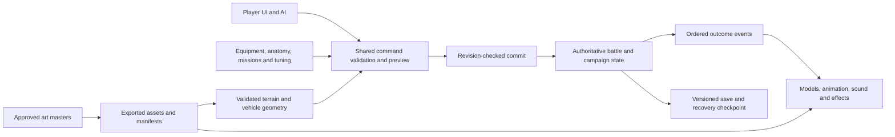

# Krag Kings — investor POC realization and integration plan

5 October 2026 · Planning baseline, not an implemented build

[Confirmed user direction](../PROJECT_CONTEXT.md) · [Source audit](14-source-and-art-audit.md) · [Character production](16-character-and-merch-production.md) · [Decisions and acceptance](17-decisions-and-acceptance.md) · [Strategic concepts](18-strategic-concept-art.md) · [Audio and voices](19-poc-audio-and-voice-plan.md)

## 1. The deliverable

Produce a downloadable Windows POC that makes the game and its character identity convincing in the same session: inspect a beautifully realized squad, customize visible equipment and tattoos, play a complete depot-salvage mission, recover survivors, and retain wounds, progression and bionic replacements afterward. Deliver campaign, base-building and world-map concept art alongside it to communicate the wider game.

The playable mission objective is now explicitly selected by the user: **release an engine, load it into a compatible carrier, and extract it**, with useful boarding opportunities. Its characters, incidents and outcome are not scripted from the narrated stories. The name Rusthook may remain a development label; neither the final story nor world geography is fixed.

The art target is the supplied concept art's premium, textured 3D appearance and distinctive anatomy. Approving a static render is insufficient: the same identity must survive motion, outfit changes, different lighting and the actual game camera. A polished mission also needs clear controls, convincing sound, a reliable executable, truthful previews and a complete outcome loop.

The user has not set a budget or deadline. This plan therefore sequences quality and risk gates rather than inventing a calendar promise. Production estimates follow the first measured asset and engine trials. “Maximum quality” means thorough execution of this bounded slice; it does not automatically add more missions or systems.

## 2. Scope boundary

| Deliverable | Included |
| --- | --- |
| Windows application | Packaged executable with startup, settings, controls, save/load, reset, clean exit and clear build version |
| Squad presentation | Close-up inspection of four proposed friendly crew using regular Krag, boss Krag and Nib body profiles; finished materials, rigging and animation |
| Customization | Authored clothing and visible armor, palette controls, authored tattoos with placement controls, fixed body proportions, persistent loadouts |
| Bionics | Forearm/hand, lower leg, eye, jaw, complete arm and complete leg coverage; species/body/side-compatible catalogue; visible installation and recovery states |
| Tactical mission | One hand-authored salvage battlefield with vehicle and foot routes, vertical access, boarding, component damage, a usable foot exit and final extraction |
| Signature machinery | Proposed core: heavy gun, crusher claw, iron jaw, burst jetpack and hostile wrecking-ball truck |
| Consequences | Stable downed crew and recovery, persistent wound/history, debrief XP/perk, treatment time, deployment lock and return to readiness |
| Audio | Original music direction and score, sound effects/ambience, distinct Krag/Nib speech and quips, subtitles, audio settings and a tested final mix |
| Presentation of the wider game | Campaign vision, fort progression/modules and 3D world-map concept sheets, explicitly marked visual exploration |
| Investor handoff | The tested build, a concise play guide, actual in-engine capture, art comparison sheets, roadmap, source/asset manifest and validation report |

The old design's four friendly / three enemy roster and one standard truck / one bike-sidecar / one hostile wrecker are a strong **proposed content baseline**, not a requirement to reproduce story dialogue or personalities unchanged. Confirm the named cast and final catalogue at G0.

Playable procedural world generation, fort construction, fort raids, daily event tables, strategic travel simulation, a second rescue/acquisition mission, multiplayer, accounts, full economy, Tin Cans and missile combat are outside this selected slice. The user confirmed concept art and integration planning only for Tin Cans. Their visual promise can appear in clearly identified concepts. No inactive button should suggest that one of these systems works.

## 3. What the investor can actually do

1. Launch the standalone build and enter the squad workshop. Rotate/zoom characters under game lighting and a neutral inspection light. View boss and regular Krag together without camera tricks.
2. Change clothing, armor and colors; place an authored tattoo; inspect both anatomical sides; select compatible initial bionic loadouts. See the real mission model, not a separate high-quality substitute.
3. Deploy into a readable depot. Use truck and bike movement, foot cover and the gantry. Fire at exposed crew/components, board a vehicle, use claw/jaw where legal, and see the wrecker's complete risk preview.
4. Release the engine and load it onto a stopped carrier. Extract cargo and remaining crew through actual rules. Vehicle loss permits a clearly explained retreat or partial recovery.
5. Read a debrief that separately reports primary objective, survivors, downed recovery, abandoned assets, XP and wounds. Nothing is silently teleported home.
6. Treat a wound or choose an elective replacement. Observe the committed part, new appearance, three-day **provisional** fitting/recovery tune, deployment restriction, completion and unchanged learned identity.
7. Save, close the application, reopen and inspect the same character. Redeploy the same mission using the recovered roster to prove persistence without requiring a second level.
8. Open the wider-game concept gallery, clearly labelled as future-game exploration, and compare it with the playable visual style.

The injury demonstration must not depend on secretly forcing a casualty in the live mission. Provide a separately labelled authored recovery scenario/checkpoint in the presentation menu, plus elective fitting in a normal run. Neither fixture injects fake rewards into the normal save. The user can then show recovery even when a well-played mission has no serious wound.

Suggested presentation pacing is an inspection/customization introduction followed by a short full battle and compact aftermath. Set the actual duration after playtests; a turn count or cinematic script is not yet a promise.

## 4. Engine comparison before selection

**Confirmed:** compare Unreal and Unity before choosing. Do not build two full POCs. First compare the capabilities needed here with the same asset inputs, then run a small equivalent scene in each. No measured winner exists yet.

| Area | Unreal candidate | Unity candidate | Decision evidence |
| --- | --- | --- | --- |
| Rendering | Native desktop renderer; evaluate Lumen versus a cheaper lighting configuration | HDRP candidate for the visual target; evaluate its lighting/material configuration | Same reference lighting, exposure, camera framing and image resolution; blind comparison to concepts |
| Rules | C++ domain records/resolver with engine adapters; Blueprint for composition/presentation | C# domain records/resolver with engine adapters | Preview/commit test, serialization, debug workflow and iteration cost |
| Characters | Skeletal meshes, modular components and animation graphs | Skinned meshes, modular renderers and animation/rig constraints | Full-limb and garment fit, jaw/pincer motion, Nib ears, boss station reach |
| Materials | Authored skin, fabric, painted metal, hair/ear and tattoo materials | Same material categories and source textures | Surface identity in neutral light, sunlight, shadows and motion |
| Distribution | Packaged Windows build | Packaged Windows build | Clean-machine startup, dependency packaging, stable save location, offline operation |
| Production ergonomics | Import, automated checks, profile capture, team familiarity | Same | Reimport a changed sleeve/arm without breaking the save or character |

Epic documents three modular-character approaches with different costs: Leader Pose shares animation but retains separate rendering; Copy Pose supports more independent behavior at higher cost; standard skeletal merging needs extra work for morph preservation. Do not assume one method suits garments, mechanical appendages and facial movement equally. [Epic modular-character documentation](https://dev.epicgames.com/documentation/en-us/unreal-engine/working-with-modular-characters-in-unreal-engine)

Unity HDRP includes dedicated hair, fabric and eye material options; these are relevant to the Nib and close-up characters, but their presence is not evidence of a better finished result. [Unity HDRP feature documentation](https://docs.unity3d.com/Packages/com.unity.render-pipelines.high-definition@17.0/manual/HDRP-Features.html)

Unreal's lighting guide explicitly distinguishes real-time quality/performance tiers from cinematic capture settings. Compare packaged real-time results and frame times, not an offline render against a real-time scene. [Epic Lumen performance guide](https://dev.epicgames.com/documentation/en-us/unreal-engine/lumen-performance-guide-for-unreal-engine)

### Common benchmark scene

Use one early approved Krag asset with finished representative skin/cloth/metal, one garment change, tattoo, complete replacement arm, animated jaw and leg; Nib head/ear material sample; boss fit blockout; one detailed truck section; a small sunlit/covered depot corner. Replicate character loads to the seven-actor roster and include all three vehicle envelopes. A representative scene is necessary before locking budgets; a single turntable or primitive-only benchmark is insufficient.

Measure cold launch, warm and cold shader/asset behavior, camera motion, repeated customization, movement/boarding, maximum visible gear, shadows, effects and save/load. Record CPU/GPU frame times, p50/p95/p99, peak RAM/VRAM, stutters, preview latency, loading duration, packaged size and import/iteration friction. Record hardware, drivers, renderer settings, internal/output resolution and upscaling.

Proposed comparison weighting: concept likeness 35%, modular character/animation correctness 25%, packaged performance 20%, production iteration/reliability 15%, distribution maintainability 5%. Broken appearance, persistence, or packaging is a hard failure regardless of weighted score. The user selected their ASUS ROG Strix G17 as the medium-range reference machine. Local inventory verified G712LV, i7-10750H, RTX 2060 with 6 GiB VRAM, about 32 GB system RAM and active 1080p display; the full record is in [17](17-decisions-and-acceptance.md). Benchmark both engines at 1080p with a proposed 60 fps target, recording power/thermal conditions and dedicated-GPU use. Minimum supported hardware and any separate showcase preset still require evidence.

Compare on the same machine with equal-quality images. Include practical fallback graphics settings. Repeat anomalous runs; retain captures and profiler traces. Present the scorecard and recommend the engine; then pin engine, packages/plugins, renderer and importer settings in a recorded decision. Do not claim a portable C++/C# implementation: content conventions and rule contracts transfer, but an engine change after production would require integration and possibly code rewriting.

## 5. Integration architecture



| Module/work package | Contract and integration responsibility |
| --- | --- |
| Domain | Stable character/vehicle/item IDs; exactly one location per entity; separate species, body profile, faction, controller, occupant and role |
| Tactical rules | Alternating groups; character AP, chassis movement and reaction ledgers; no refreshed actions from transfers; shared legality for AI/UI |
| Geometry/navigation | Layered foot routes, stairs, vehicle/node transforms, curved swept vehicle paths, jet trajectories, occupancy and legal fallback points |
| Combat | Exposed-target queries, damage order, component disablement, ram/swing contact, reactions and interruption; effects never cause duplicate hits |
| Appearance | Resolve body regions, wardrobe layers, visibility masks, tattoos, bionic parts, materials and rig/animation capabilities from one validated loadout |
| Equipment | Species, profile, side, anatomy coverage, hand function, strain, back-slot fit, armor stats and ability requirements; no UI-only restrictions |
| Campaign slice | Debrief ledger, learned perks, injury/elective history, inventory, one treatment place, integer days, deployment eligibility |
| Presentation | State/event-driven models, motion, HUD, camera, audio and VFX; animation duration/frame rate cannot change rules |
| Persistence | Versioned state/content IDs and RNG, atomic write, backup/recovery, referential validation, supported migration or clear rejection |
| Content tools | Validated manifests, deterministic fixtures, import/asset validators, build profile and local test reporting |

Use stable commands including PreviewLoadout, ApplyLoadout, Move, Board, Transfer, Fire, Swing, Interact, Extract, FinaliseEncounter, ResolveDebrief, StartTreatment and AdvanceDay. Appearance changes in the workshop use the same compatibility rules as deployment. Initial fitting and subsequent surgical replacement are different workflows: the first fixture can initialize a valid character, but a campaign garment change cannot bypass bionic installation time.

Authoritative state must be plain serializable data independent of visible transforms. Preview is read-only and does not advance RNG. Commit revalidates revision/geometry/resources, spends once, emits ordered events and updates the revision. Save only at stable decisions, with clear feedback during resolution. Retain separate combat, campaign and cosmetic random streams if each is needed; the compact recovery clock does not require daily random events.

Determinism means repeatable outcomes for the same build/content/seed and saved inputs. Do not claim cross-engine or cross-version bit-identical physics. Use bounded kinematic resolution, stable ordering and recorded interruption events for the tactical rules; keep ragdolls, cloth and chain secondary motion cosmetic.

### Appearance and gameplay transaction

Validate a candidate item set; derive covered anatomy and garment masks; calculate functions/armor/strain; resolve matching assets; load them; then display the committed combination. Invalid fit leaves the prior state unchanged and explains the reason. Missing assets fail content validation before shipping. Never let a visually equipped plate lack armor data, or an unequipped plate remain visible.

Tattoos belong to anatomical skin regions, with authored design ID, side, region-local placement, rotation, size, color and layer order. A replaced arm hides its skin tattoos; it does not project them onto a mechanical arm. Clothing occludes tattoos naturally. Save the original tattoo record for history and future compatible changes. Bionic paint is a separate material system. The full asset contract is in [16](16-character-and-merch-production.md).

## 6. Mission and vehicle production

Block out the old approximately 120 × 120 m depot proposal, then adjust dimensions to route/turn measurements. Establish one primary truck circuit, an alternate escape lane, protected foot approach, useful gantry with stairs, console, engine/cradle, loading access and separate supported foot/vehicle exits. Use the art sheet for materials and construction, not exact coordinates.

Run regular Krag, boss, Nib, loaded truck, sidecar, recovery pair and large equipment through the routes. Place a wreck at the worst likely choke point. Keep an accessible ground solution without jetpack, no unavoidable spawn hit, no all-map dominant roof, and no boss trapped outside the objective.

Build the standard truck and wrecker from one approved chassis source. Keep wheels, engine access, steering, ram, gun, crew nodes and damage parts explicit. The wrecker's crane replaces the gun and cargo function. The standard truck remains the engine carrier; capturing the wrecker does not magically produce a spare cargo hold. Author one continuous ball/chain/boom and a validated stow/deploy/swing/return sequence at the same scale.

Bike and sidecar need rider reach, passenger/claw fit and a truthful assembled collider. Keep the sidecar on the rider's right. Fit Nib controls without resizing the character. Validate boss access to the truck gun station and reject unsupported seats explicitly.

Finish the environment as a modular kit: terrain, eroded stone walls, ruin corners/doorways, cover, one breakable barrier, catwalk deck/stairs/rails, loading crane, console, salvage engine, scrap bundles, gates and restrained dressing. Include collision, occlusion and traversable metadata with each piece. Damage/wreck states must match what the player sees. Lighting and weathering should unify the kit without obscuring targets or UI.

Enemy AI uses the same candidates, previews and budgets as the player. It must contest objectives, engage exposed threats, handle boarders, reposition its wrecker and terminate an activation when no useful action exists. Bound search and provide a legal end/wait fallback; never an infinite retry loop. Start fully observable for internal rule tests, then implement the chosen visibility contract before final playtests.

## 7. Compact aftermath and presentation systems

Award XP once per encounter, keep learned perks separate from installed equipment benefits, retain injury history and enforce patient availability in domain rules. Existing values such as two AP, 8/2 strain and three recovery days are starting data. Full-limb definitions need explicit strain, restored functions, hand capabilities and non-stacking rules before production implementation.

The selected slice needs a complete ending even after failure. Persist captured/missing/lost distinctions, but do not expose a fake rescue mission. Proposed boundary: finish the demo with a truthful outcome and a fresh-run option when no deployable roster remains; normal survivors can return to the workshop. A future rescue continuation is described in the roadmap. This reduction from file 11 requires explicit design approval at G0.

Audio production covers distinct engines, movement surfaces, gun/recoil, metal claw/jaw, jetpack, crane/chain/ball, component failures, UI, desert ambience and original music. Use AI-generated English character speech for the POC: deep, gruff Krags and higher-pitched, faster-speaking Nibs, with distinct individual personalities. Keep the pipeline ready for later actor recordings if finances allow. Mix for tactical clarity; do not mask alerts with spectacle. The detailed cue manifest, music states, performance bible, dialogue scheduler and acceptance tests are in [19 — audio and voices](19-poc-audio-and-voice-plan.md). Accent/provider selection belongs to auditions; no choice has been assumed. The supplied stories are tone references rather than a recorded-dialogue script.

UX must make the next legal action and its cost obvious, with scalable text, remapping, volume controls, color-independent symbols, reduced motion, skippable focus shots and reliable camera return. Show invalid fit/route reasons. Include a short contextual introduction that does not force a predetermined strategy or injury. Build the investor flow from the same executable as the test build; keep debug views separate.

## 8. Production gates and dependencies

Internal greyboxes remain useful throughout. They are interim verification artifacts; none may substitute for visible final assets in the investor mission or customization room.

| Gate | Work and owner discipline | Dependency | Evidence required to exit |
| --- | --- | --- | --- |
| G0 — brief locked | Design/art/technical leads reconcile scope, cast, mission, full-limb item catalogue, fit rules and pending decisions | This plan and user answers | Versioned decisions; asset manifest; approved diagrams for conflicting views; hardware test target |
| G1 — engine and import proof | Technical art + engineering build the shared Unreal/Unity comparison; character art supplies representative materials/forms | G0 identity and benchmark brief | Two equivalent packaged trials, images/profile traces, scored decision, pinned production stack |
| G2 — character quality proof | Character artist + rigger + technical artist complete one regular Krag, modular clothing/armor/tattoo, full arm/leg and jaw; Nib/boss look/fit samples | G1 plus approved concepts | Neutral/desert render comparisons; gameplay/close-up inspection; full animation/fit tests; appearance save/reload |
| G3 — rules and mission greybox | Gameplay engineering + design implement turns, movement, stations, damage, boarding, jetpack, wrecker, AI, objective and recovery | G1; can overlap G2 after contracts stabilize | Mission win/retreat/loss through UI; invariant tests; route and reaction evidence |
| G4 — integrated production assets | Art/animation/audio/UI replace the full roster, rigs, terrain and interface with approved assets; expand proven modular catalogue | G2/G3 pass; station envelopes fixed | Every visible asset accepted in engine; no placeholder dependencies; completed gear/pose matrix |
| G5 — persistent gang slice | Gameplay/UI integrate debrief, perks, wounds, treatment, full-limb fit, save recovery and redeployment | Stable G3 state plus G2 appearance | End-to-end mission → wound/elective replacement → recovery → app restart → redeploy |
| G6 — quality and performance | QA/design/engineering/art run external playtests, profiling and polish; fix root causes | G4/G5 feature complete | Release criteria in file 17; hardware results; resolved critical/major defects; approved likeness |
| G7 — investor handoff | Production packages build, play guide, captures, approved concept gallery and roadmap | G6 accepted build | Clean-machine rehearsal; frozen build/checksum; recoverable saves; complete source and evidence handoff |

Critical dependency chain: approved anatomy → region/rig contract → one successful modular character → full catalogue → integrated mission → release validation. Expensive detail on all characters before G2 multiplies rework risk. Mission logic and strategic concept exploration can advance independently while the first character is refined.

The first character is complete only when its entire pipeline works; a gorgeous sculpt without topology, clothing fit, animation and engine materials does not pass G2. The final gate requires the whole squad, not only the first hero.

## 9. Repository and asset handoff

After engine selection, create a production structure with clear ownership:

```text
game/                  Selected engine project and pinned dependencies
art-source/            Editable body, wardrobe, vehicle and terrain masters
art-export/            Versioned engine-ready meshes, textures and manifests
krag-kings-design/     Requirements, approved references and decision records
tests/fixtures/        Rule, geometry, appearance and persistence scenarios
build-scripts/         Reproducible Windows packaging and validation
evidence/              Acceptance images, profiler results and test reports
delivery/              Ignored/local staged build and investor handoff package
```

Use appropriate large-file storage and asset ownership/locking for editable binaries; decide the provider with the production repository setup. Preserve original references and master source independently of exported assets. Save per-asset IDs, source version, content hash, body/skeleton compatibility, LODs, sockets, material slots, bounds, import settings and review state in manifests. Build from a clean checkout with documented prerequisites. No developer absolute paths or external loose textures in the release.

For Unreal, prove the chosen Blender/exporter route with the engine's FBX pipeline before mass export; Epic documents animation, LOD and morph import and identifies FBX 2020.2 compatibility. This is an importer constraint to test, not a claim every exporter produces identical results. Materials are rebuilt/validated in-engine from source maps. [Epic FBX skeletal-mesh pipeline](https://dev.epicgames.com/documentation/en-us/unreal-engine/fbx-skeletal-mesh-pipeline-in-unreal-engine)

Keep one documented conversion between DCC metres/orientation, domain coordinates and engine coordinates. The old Y-up/+Z-forward GLB convention is not automatically valid for both candidates. A known-size axis asset, skeleton, socket, collider and animation round trip must pass before export presets are locked.

## 10. Staffing, estimates and change control

Required capabilities are art direction/concept reconciliation, senior character sculpt/surfacing, technical character art/rigging, animation, vehicle/environment art, gameplay/systems engineering, UI/UX, sound and QA. One person may cover several roles, but every gate still needs its evidence. The plan does not assume that procedural mesh generation alone can deliver the requested character quality.

Estimate using measured work: first approved body and outfit, one whole-limb fit, one completed animation family, one vehicle section and first packaged mission loop. Expand those measurements by the actual manifest count, add fit/combination verification and explicit iteration allowance, then form a calendar from real staffing. Budget, team and dates remain unset by user choice; no hiring or purchases have been made.

Change requests record their effect on concepts, meshes, rigs, animation, gameplay, persistence and test combinations. If schedule pressure appears, reduce the number of optional cosmetic designs or future systems with the user; do not silently lower likeness or release quality. Preserve the user's minimum replacement categories and all confirmed deliverables.

## 11. Principal risks and planned response

| Risk | Early evidence / response |
| --- | --- |
| Model looks similar but loses merchandise identity | Approve matched views and facial/silhouette landmarks before texture detail; compare runtime and merchandise derivatives to the same master |
| Clothing/full-limb combinations clip | Layer/region system, cut/fit variants and a real pose matrix at G2; enforce unsupported fits in data |
| Heavy body and unusual proportions break animation | Profile-specific rigs/weights/correctives; test boss gun station, Nib controls and Brok sidecar before production animations |
| New full replacements change gameplay balance | Explicit function/strain/coverage definitions and examples; no automatic double bonuses or restored precision on a claw |
| High quality only works in offline renders | Mandatory packaged gameplay/camera tests; same runtime assets in workshop and battle; measured scalability |
| Mechanics overwhelm mission readability | Keep the roster/map small, teach through context, playtest unassisted, prune only through deliberate scope decisions |
| Simulation and animation disagree | Events own outcomes; validate sweep geometry and stable checkpoints; secondary physics cannot grant hits |
| Partial campaign creates an incomplete ending | Approve bounded failure/persistence rules and clearly mark future campaign concepts |
| Source/derived art drifts | Version approved design IDs, retain comparison evidence and require re-review when identity changes |

## 12. Definition of delivered

The POC is delivered when the entire confirmed player flow runs on the agreed Windows hardware, the finished squad matches approved concept-derived masters, all supported customization/replacement combinations have recorded validation, and the release gate in file 17 passes. Strategic concept sheets and actual gameplay captures must be labelled distinctly. The source, editable masters, export settings, tests, build instructions and evidence accompany the executable.

No build or 3D production asset has been completed by writing this plan. The next production work is G0/G1 and the first modular character proof; execution begins from the decision register, not from an assumption that the old browser scaffold already exists.
