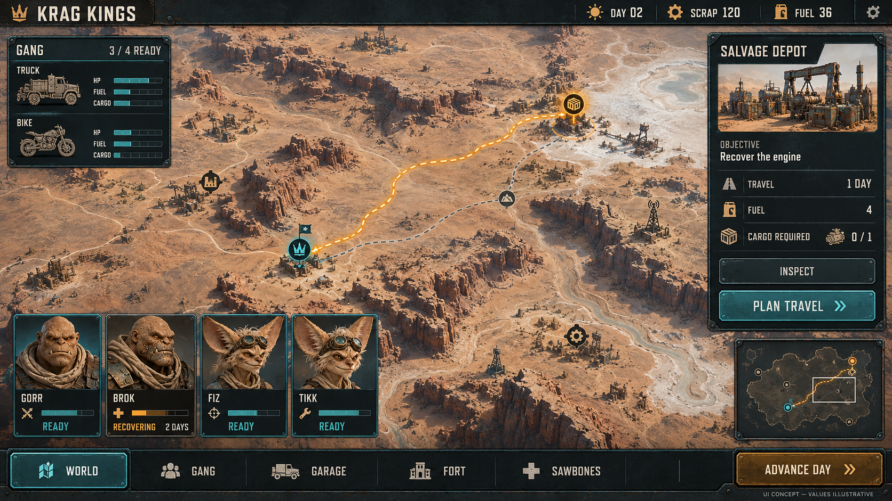
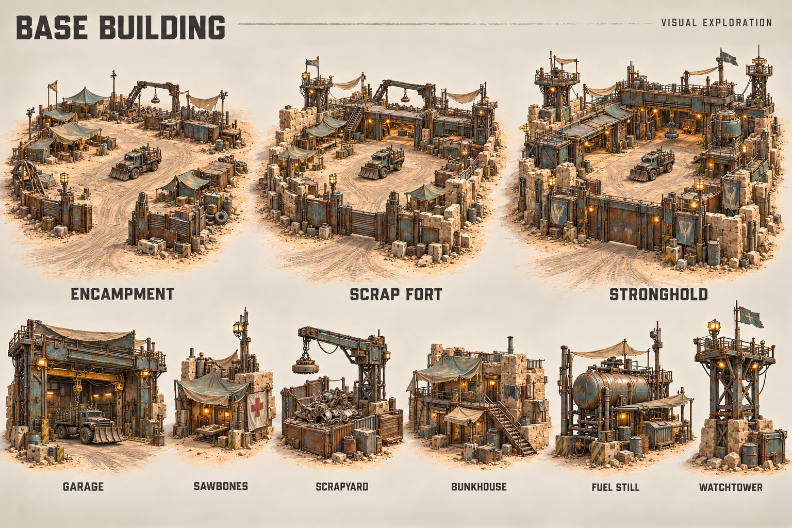
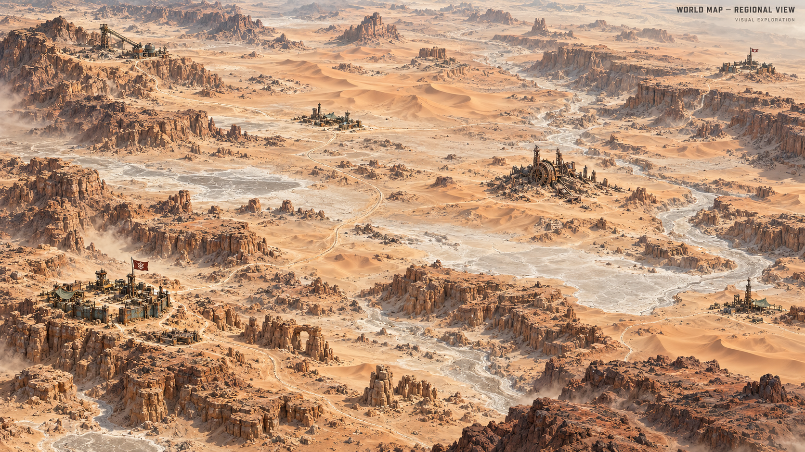
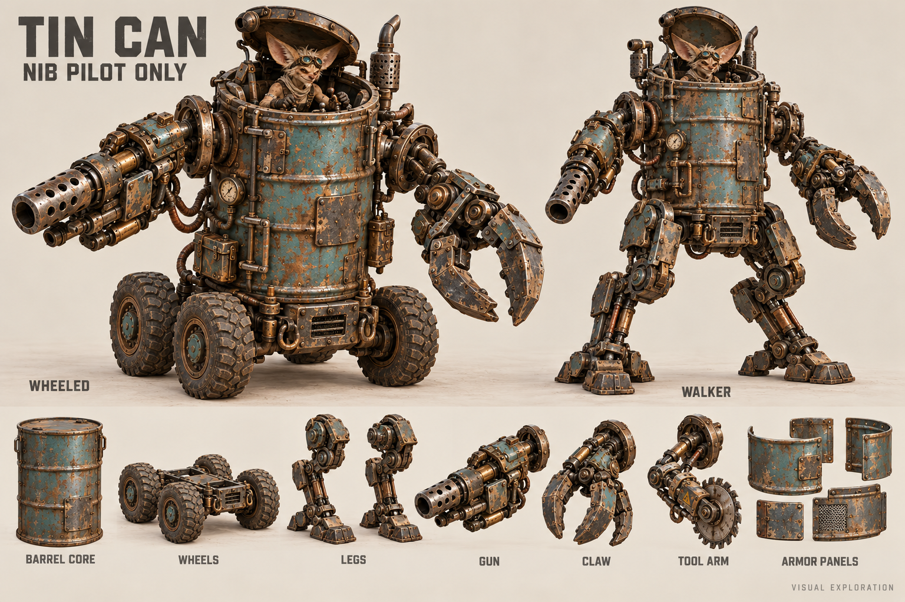

# Strategic and Tin Can concept explorations

5 October 2026 · [Realization plan](15-poc-realisation-plan.md)

Four initial sheets and two revisions were generated with the built-in image-generation tool and visually inspected during this planning session. The original ten reference sheets and the first versions are preserved unchanged. These images are **visual explorations**, not captured gameplay, approved production turnarounds, a final campaign scenario or manufactured assets. They are saved inside this project; the exact prompts are recorded below.

User review, 5 October 2026: the cinematic campaign sheet did not meet the campaign UX/UI brief; the world map needed a much bigger, sparser view, like a Total War regional map. The modular Tin Can received explicit approval (“tin can is great”). The replacement campaign interface and regional map below are **awaiting user review**. Base-building art has not yet received explicit approval. Tin Can approval covers the visual direction; its production and fit details remain open.

## 1. Deliverables and review notes

| Sheet | Review status | What it explores / still to resolve |
| --- | --- | --- |
| [11 v2 — Campaign UX/UI](concept-art/11-campaign-ui-v2.png) | Awaiting review | Strategy interface with resources, vehicle condition, crew readiness/recovery, destination details, route planning and campaign navigation. Values, cast, icons, labels and control behavior are illustrative, not approved game balance or a working interface. Portraits do not replace character masters; final vehicle icons must preserve actual vehicle/sidecar designs. |
| [12 — Base building](concept-art/12-base-building-exploration.png) | Awaiting review | Encampment → scrap fort → stronghold, central vehicle yard, garage/Sawbones/scrapyard/bunkhouse/fuel still/watchtower. Build grid, circulation measurements, costs, stage boundaries and interiors remain open. Even the encampment is relatively developed; signage is provisional. |
| [13 v2 — Regional world map](concept-art/13-world-map-regional-v2.png) | Awaiting review | Broader continuous desert, extensive open terrain and widely separated sites at strategic scale. Geography, distances, node positions, factions, flags and travel rules remain provisional. Total War informs viewing scale and spacing, not mechanics or copied identity. |
| [14 — Modular Tin Can](concept-art/14-tin-can-modular-exploration.png) | Visual direction approved | Tall cylindrical scrap barrel, Nib pilot, wheeled/walking fits, gun/claw/tool arms and curved armor. Hatch closure around ears, entry/exit, seated pilot clearance, module limits, mechanics and manufacturing details need turnarounds/fit review. Illustrated alternatives are candidates, not automatically playable features. |

The concepts use the original warm desert materials and detailed 3D rendering direction. The Tin Can preserves its round barrel core. Its Nib remains a person operating a vehicle. The sheet does not imply the machine can board other vehicles.

## 2. Campaign UX/UI — revision 2, awaiting review



The concept illustrates a proposed decision flow: inspect crew and vehicle readiness, select a destination, compare routes and costs, then plan travel. It does not establish the interaction rules or add playable campaign scope to the POC. [Original cinematic sheet](concept-art/11-campaign-vision-exploration.png) retained as history; rejected for this interface brief.

## 3. Base-building progression and modules



## 4. Regional world-map direction — revision 2, awaiting review



The regional composition is a separate scale study; it is not an exact second view of the campaign interface's geography. [Original compact map](concept-art/13-world-map-exploration.png) retained as history; superseded because the user requested a much broader, sparser view.

## 5. Tin Can — visual direction approved



## 6. Exact prompt record

Generation mode: built-in image-generation tool, with local concept images supplied as references. No fallback CLI/API mode was used. All outputs use an opaque background.

### Campaign vision — original, rejected for the UX/UI brief

References: original terrain sheet 06, truck sheet 03, Krag sheet 01, Nib sheet 02, in that order.

```text
Use case: stylized-concept.
Asset type: new campaign vision concept sheet for Krag Kings investor planning.
Input images: image 1 is environment/material/style reference; image 2 is vehicle identity reference; image 3 is Krag species identity reference; image 4 is Nib species identity reference. These are references, preserve their designs but create a new campaign composition.
Primary request: Show the wider campaign promise of a high-quality 3D turn-based desert salvage game, in precisely the same semi-realistic detailed 3D-rendered style as the references. This is visual exploration, no fixed story, names or geography.
Composition: wide landscape production-art sheet, warm off-white margins. A large cinematic elevated three-quarter view occupies upper two thirds: a battered teal four-wheel salvage truck and right-sidecar bike travel through an expansive sandstone canyon towards a scrapyard outpost, huge distant half-buried anonymous industrial wreck silhouette. No new faction logos. Lower third has three clean separate smaller vignette studies: departing the fortified scrapyard, crew securing salvage in an industrial ruin, returning home with battered vehicle and visible replacement limbs. Keep each vignette coherent and legible, not a chaotic collage.
Style: physically convincing worn steel, chipped restrained teal, warm brass, copper pipes, dusty canvas, pale warm sandstone, realistic scale of grime, cinematic warm desert light without orange wash, meticulous premium game key art. Krags are hulking sandstone-skinned bald adults with cracked skin and small tusks; Nibs are small wiry adult nonhuman mechanics with exactly one pair of huge fennec-like ears, as in reference. No green skin, no generic human soldiers, no flat cartoon or comic shading.
Text: only 'CAMPAIGN VISION' at top and small 'VISUAL EXPLORATION' at bottom. No dates, invented place names, dialogue, HUD or numbered story sequence. Avoid tiny unreadable detail and repeated trucks accidentally fused together.
```

### Base building

References: original terrain sheet 06 and truck sheet 03, in that order.

```text
Use case: stylized-concept. New Krag Kings production concept art. Reference image 1 defines the existing terrain's premium semi-realistic 3D material/rendering style; reference image 2 defines the actual teal four-wheel salvage truck identity. Preserve that exact visual language: pale eroded sandstone, dusty canvas, worn riveted steel, restrained chipped teal paint, warm brass/copper machinery, high surface detail, believable construction and exaggerated industrial personality. Warm off-white studio sheet margins, high-quality crisp landscape composition. No flat cartoon, no neon science-fiction, no franchise logos, no green-skinned creatures. This is provisional visual exploration, not final geography, story, approved gameplay or a screenshot.
Asset type: base-building visual exploration sheet.
Primary request: Show a desert gang's fort evolving from tents and wreckage into a substantial industrial stronghold, with credible vehicle circulation and a shared recognizable layout.
Composition: three coherent elevated three-quarter dioramas of the SAME desert plot, at the same camera angle, across the upper half: 'ENCAMPMENT', 'SCRAP FORT', 'STRONGHOLD'. The same broad vehicle entry and central work yard persist as upgrades build outwards, never a maze of inaccessible buildings. Tents and wreck salvage become stone/steel fortifications, a larger garage and watchtowers. Scale truck parked in each yard.
Lower half: six separated detailed building module studies, tasteful editorial spacing: 'GARAGE' with wide bay and hoist; 'SAWBONES' modest clinic/workshop; 'SCRAPYARD' sorted metal and crane; 'BUNKHOUSE' canvas/stone living quarters; 'FUEL STILL' tank/pipes; 'WATCHTOWER' steel observation platform. These are invented game structures, artistic exteriors only. Functional entrances, walkways, and loading areas.
Text only: 'BASE BUILDING' main title, three stage names, the six module labels, and small 'VISUAL EXPLORATION'. No numerical stats, prices, build grid, faction names or fixed locations. Style and craftsmanship match the existing terrain sheet exactly.
```

### World map — original, superseded scale study

References: original terrain sheet 06 and truck sheet 03, in that order.

```text
Use case: stylized-concept. New Krag Kings production concept art. Reference image 1 defines the existing terrain's premium semi-realistic 3D material/rendering style; reference image 2 defines the actual teal four-wheel salvage truck identity. Preserve that exact visual language: pale eroded sandstone, dusty canvas, worn riveted steel, restrained chipped teal paint, warm brass/copper machinery, high surface detail, believable construction and exaggerated industrial personality. Warm off-white studio sheet margins, high-quality crisp landscape composition. No flat cartoon, no neon science-fiction, no franchise logos, no green-skinned creatures. This is provisional visual exploration, not final geography, story, approved gameplay or a screenshot.
Asset type: world-map concept sheet.
Primary request: A beautiful high-detail 3D miniature desert strategic world map with travel between locations, visually continuous with the existing terrain art, not a flat parchment map and not a literal planet.
Composition: one large elevated oblique map across 80 percent of the sheet, a miniature cutaway expanse with rocky sandstone canyons, dry riverbeds, pale glass flats and scrap fields. Connect about seven clear destinations via thin restrained dusty-road/dotted-route paths: one fortified home scrapyard, industrial salvage depot, small trader outpost, rival scrap fort, abandoned works, remote wreck site, huge half-buried anonymous industrial machine. Main and alternative routes visibly pass through real terrain; no bright sci-fi holograms. A tiny teal truck on one road gives travel scale. Clear uncluttered shapes at strategic zoom while maintaining rich high-quality 3D surface materials. Use a neutral subtle amber ring on one selected destination, not a large UI overlay.
Along lower edge three separated close-up studies labelled 'FORT', 'SALVAGE', 'TRAVEL'. Minimal title 'WORLD MAP' top-left and small 'VISUAL EXPLORATION' footer. No other text, no invented proper names, no compass coordinates, no chapter/story numbering, no real-world geography. Only terrain and location design exploration, not a promised fixed world layout.
```

### Tin Can

References: original Nib sheet 02, truck sheet 03 and heavy-bionics sheet 07, in that order.

```text
Use case: stylized-concept.
Asset type: new Tin Can modular vehicle concept sheet for Krag Kings.
Input images: image 1 is Nib anatomy/face/style reference, image 2 is scrap machinery materials/style reference, image 3 is bionic/mechanical craftsmanship reference. References only; create a new machine.
Primary request: Design a tall ROUND cylindrical tin-can/barrel machine assembled from refitted scrap junk, exclusively piloted by a small adult Nib. Its unmistakable core is an upright battered industrial drum with circular lid/base, rolled ribs, welded patch plates and rivets. The barrel is taller than it is wide, with curved walls clearly visible. It is not a square armored torso, generic humanoid robot, human soldier suit or copied franchise walker.
Composition: premium wide warm off-white concept sheet. Large left three-quarter hero: tall teal/rust barrel body on a compact four-wheel undercarriage, one oversized scrap gun arm and one industrial claw arm attached through clearly visible circular side sockets. Nib-scale access hatch opened enough to reveal a seated Nib operator at controls, not a robot head. Pale-haired wiry sandy adult Nib with exactly two large fennec ears and goggles, practical layered desert clothes. Machine supports its own heavy equipment. Short external exhausts, gauges, copper hoses and mechanical swagger, but the barrel silhouette stays clean.
Upper right: same cylinder body on alternative articulated walking legs, shown as a whole assembled alternate locomotion fit; same module socket locations. Lower strip: distinct separated interchangeable studies labelled 'WHEELS', 'LEGS', 'GUN', 'CLAW', 'TOOL ARM', 'ARMOR PANELS'. Armor panels are curved and bolt around the barrel, never turn it into a box. No free-floating functional parts in the assembled views. One small plain barrel-core study to show cylindrical foundation.
Style: exactly the semi-realistic highly detailed textured 3D concept rendering of the references, physically convincing worn steel, sandy dust, chipped restrained teal paint, warm brass, copper pipes, oversized purposeful mechanisms. No green skin, no skull motifs, no faction emblems, no neon, no cartoon flat shading, no humans or Krag pilots, no independent robot personality face.
Text only 'TIN CAN', 'NIB PILOT ONLY', 'WHEELED', 'WALKER', listed module labels, and small 'VISUAL EXPLORATION'. No dimensions, lore names, stats, manufacturing blueprint or suggested vehicle boarding.
```


### Campaign UX/UI — revision 2

References: original terrain sheet 06 (materials), Krag sheet 01 and Nib sheet 02 (portrait identity), in that order.

Saved as `concept-art/11-campaign-ui-v2.png`. Built-in image generation; opaque background. Awaiting user review.

```text
Use case: ui-mockup.
Asset type: revised Krag Kings CAMPAIGN UX/UI concept for a premium PC 3D tactical game.
User correction: the previous campaign image was cinematic key art and failed the brief. This replacement MUST be an actual GAME INTERFACE mockup showing campaign management and travel decisions. Single full-screen 16:9 landscape PC screenshot composition, crisp readable interface, no poster, no cinematic convoy close-up, no storyboard panels or off-white concept-sheet margins.
Input images: image 1 is environment/material reference ONLY, image 2 Krag portrait reference, image 3 Nib portrait reference. Keep exactly these species and material identities.
Main play surface: a large, distant high-angle 3D desert region map with broad open sandy terrain, long canyon systems, dry riverbeds, pale salt flats, sparse tiny scrapyard settlements and faint roads. Total War-like strategic camera distance and geographical scale, but original Krag Kings visuals and UI. Buildings are tiny at this zoom. At least three quarters of the map is open land between destinations. No huge trucks or buildings dominating the map. An amber route connects a selected gang marker to a selected salvage depot; alternate route faint and unselected.
Interface: slim charcoal top bar 'KRAG KINGS' on left, 'DAY 02', 'SCRAP 120', 'FUEL 36' clearly separated. Compact left panel 'GANG' with '3 / 4 READY', truck and bike icons, concise condition bars. Bottom-left four recognizable adult character portrait cards: GORR a large gruff sandstone Krag; BROK sandstone Krag with metal jaw; FIZ and TIKK wiry adult Nibs with exactly one pair of giant fennec ears, goggles and practical desert gear. Three cards show 'READY', Brok 'RECOVERING' and '2 DAYS'. Use teal active selection and amber recovery marker with text. No human faces or green orcs.
Right panel, tidy and no more than a fifth of screen: title 'SALVAGE DEPOT', objective 'Recover the engine', fields 'TRAVEL 1 DAY', 'FUEL 4', 'CARGO REQUIRED', two distinct controls 'INSPECT' and primary 'PLAN TRAVEL'. Bottom navigation: 'WORLD', 'GANG', 'GARAGE', 'FORT', 'SAWBONES'; separate right-hand button 'ADVANCE DAY'. Small inset minimap at lower-right only if it fits without clutter. Central map remains the dominant working area.
UI design: clean professional strategy-game information hierarchy, restrained weathered teal/steel trim, dark neutral panels and clear warm off-white sans-serif text. Mechanical visual identity through subtle material touches, never oversized decorative gears, distressed illegible fonts or text over busy terrain. Distinct visual selection, route, resources, roster availability and next action at a glance. No invented final place names, faction names, story dialogue or chapter sequence. Tiny unobtrusive footer 'UI CONCEPT — VALUES ILLUSTRATIVE'. High-quality semi-realistic 3D world as in reference, sharp functional flat UI overlays.
```

### Regional world map — revision 2

References: first world map sheet 13 (redesign target), original terrain sheet 06 (materials/style), in that order.

Saved as `concept-art/13-world-map-regional-v2.png`. Built-in image generation; opaque background. Awaiting user review.

```text
Use case: stylized-concept.
Asset type: revised Krag Kings world-map concept, version 2.
Input images: image 1 is the PREVIOUS MAP TO REDESIGN; image 2 is material/style reference only.
User correction: map needs a MUCH BIGGER VIEW and must be MUCH MORE SPARSE, like the regional campaign view of a Total War game. Preserve Krag Kings original detailed semi-realistic 3D sandstone/desert/scrap style, but radically change scale and composition.
Composition: one full-bleed wide 16:9 landscape view. Pull the camera about ten times farther back than the old map: look obliquely down over an enormous contiguous desert REGION stretching far beyond every edge of the image. Show extensive empty dunes, large eroded mountain/canyon belts, broad pale flats, distant badlands and long dry river valleys. No horizon-dominant cinematic sky. No floating island, no cutaway tabletop edge, no off-white studio backdrop, no miniature diorama pedestal, no giant title or bottom vignette strip.
Scale and spacing are the entire point: 85–90 percent natural open terrain. Only 6–8 tiny distant built locations across the entire region; each occupies at most roughly one percent of image width. Huge distances separate the scrapyard home fort, a depot, a trader settlement, a remote rival outpost, a ruined works and an industrial wreck site. A few faint winding tracks follow terrain across long distances. One tiny selected gang/banner marker near the home fort; no giant vehicles visible at regional zoom. Architectural materials at nodes are weathered steel, restrained teal, dusty canvas and pale sandstone. Landforms should vary organically in size and shape; no evenly spaced grid of identical canyon arenas.
Atmosphere: clear readable warm afternoon lighting, soft distance haze, high-detail 3D terrain and beautiful broad terrain color variation from cream flats through pale gold dunes to rusty rock. Grandeur through distance and empty land, not packed props. No green vegetation unless extremely sparse, no medieval cities, European castles, franchise logos, copied game UI or fantasy armies. Only a small corner label 'WORLD MAP — REGIONAL VIEW' and tiny 'VISUAL EXPLORATION'. Geography and locations are provisional design studies, not a final campaign.
```
