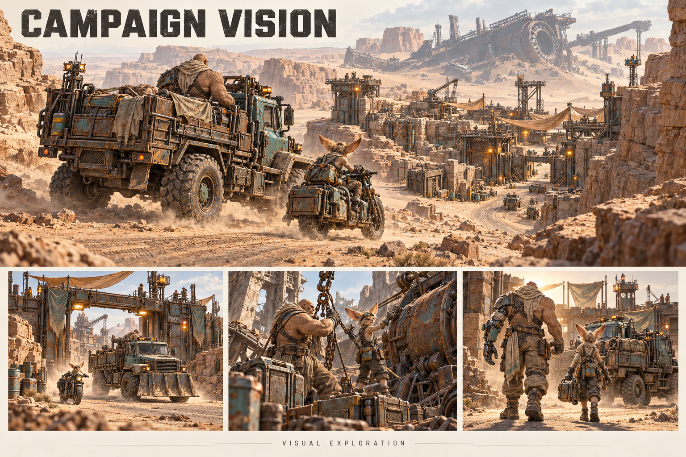
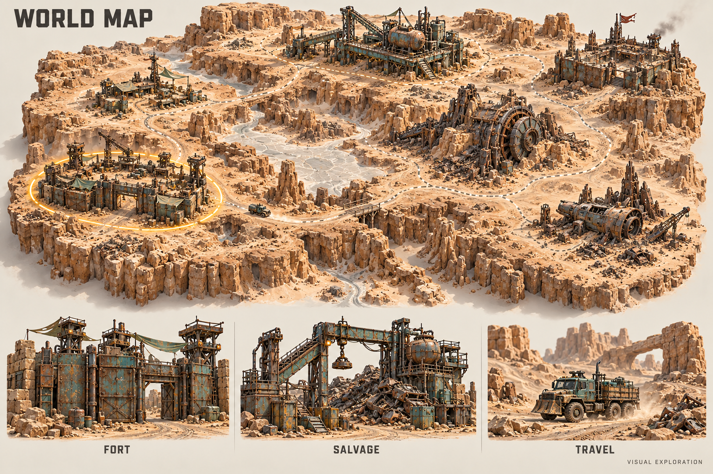

# Strategic and Tin Can concept explorations

5 October 2026 · [Realization plan](15-poc-realisation-plan.md)

Four new sheets were generated with the built-in image-generation tool and visually inspected during this planning session. The original ten reference sheets are preserved unchanged. These new images are **visual explorations**, not gameplay screenshots, approved production turnarounds, a final campaign scenario or manufactured assets. They are saved inside this project; the exact prompts are recorded below.

## 1. Deliverables and review notes

| Sheet | What it explores | Still to resolve |
| --- | --- | --- |
| [11 — Campaign vision](concept-art/11-campaign-vision-exploration.png) | Desert travel, salvage, crew/vehicle identity and return to an inhabited scrapyard; consistent sandstone/teal/steel style | Locations, final geography, story and specific mission sequence remain open. Small background characters are mood references, not new character masters. |
| [12 — Base building](concept-art/12-base-building-exploration.png) | Encampment → scrap fort → stronghold, central vehicle yard, garage/Sawbones/scrapyard/bunkhouse/fuel still/watchtower | Actual build grid, circulation measurements, upgrade costs, stage boundaries and facility interiors are not designed by this image. Review staging: even its encampment is relatively developed. Signage is provisional. |
| [13 — World map](concept-art/13-world-map-exploration.png) | A detailed 3D miniature strategic desert, distinct destinations and alternate travel routes | Not final world topology, map generation, place names or UI. Node positions and travel rules need later gameplay design. |
| [14 — Modular Tin Can](concept-art/14-tin-can-modular-exploration.png) | Tall cylindrical scrap barrel, Nib pilot, wheeled/walking fits, gun/claw/tool arms and curved armor | Hatch closure around ears, entry/exit, seated pilot clearance, module limits, mechanics and manufacturing details need turnarounds/fit review. Tool-arm ability and all illustrated alternatives are candidates, not automatically playable features. |

All four preserve the original warm desert materials and detailed 3D rendering direction. The Tin Can specifically preserves a round barrel core rather than a box-shaped mech body. Its Nib remains a person operating a vehicle. The sheet does not imply the machine can board other vehicles.

## 2. Campaign vision



## 3. Base-building progression and modules


## 4. World-map direction



## 5. Tin Can direction


## 6. Exact prompt record

Generation mode: built-in image-generation tool, with local concept images supplied as references. No fallback CLI/API mode was used. All outputs use an opaque background.

### Campaign vision

References: original terrain sheet 06, truck sheet 03, Krag sheet 01, Nib sheet 02, in that order.

```text
Use case: stylized-concept.
Asset type: new campaign vision concept sheet for Krag Kings investor planning.
Input images: image 1 is environment/material/style reference; image 2 is vehicle identity reference; image 3 is Krag species identity reference; image 4 is Nib species identity reference. These are references, preserve their designs but create a new campaign composition.
Primary request: Show the wider campaign promise of a high-quality 3D turn-based desert salvage game, in precisely the same semi-realistic detailed 3D-rendered style as the references. This is visual exploration, no fixed story, names or geography.
Composition: wide landscape production-art sheet, warm off-white margins. A large cinematic elevated three-quarter view occupies upper two thirds: a battered teal four-wheel salvage truck and right-sidecar bike travel through an expansive sandstone canyon towards a scrapyard outpost, huge distant half-buried anonymous industrial wreck silhouette. No new faction logos. Lower third has three clean separate smaller vignette studies: departing the fortified scrapyard, crew securing salvage in an industrial ruin, returning home with battered vehicle and visible replacement limbs. Keep each vignette coherent and legible, not a chaotic collage.
Style: physically convincing worn steel, chipped restrained teal, warm brass, copper pipes, dusty canvas, pale warm sandstone, realistic scale of grime, cinematic warm desert light without orange wash, meticulous premium game key art. Krags are hulking sandstone-skinned bald adults with cracked skin and small tusks; Nibs are small wiry adult nonhuman mechanics with exactly one pair of huge fennec-like ears, as in reference. No green skin, no generic human soldiers, no flat cartoon or comic shading.
Text: only 'CAMPAIGN VISION' at top and small 'VISUAL EXPLORATION' at bottom. No dates, invented place names, dialogue, HUD or numbered story sequence. Avoid tiny unreadable detail and repeated trucks accidentally fused together.
```

### Base building

References: original terrain sheet 06 and truck sheet 03, in that order.

```text
Use case: stylized-concept. New Krag Kings production concept art. Reference image 1 defines the existing terrain's premium semi-realistic 3D material/rendering style; reference image 2 defines the actual teal four-wheel salvage truck identity. Preserve that exact visual language: pale eroded sandstone, dusty canvas, worn riveted steel, restrained chipped teal paint, warm brass/copper machinery, high surface detail, believable construction and exaggerated industrial personality. Warm off-white studio sheet margins, high-quality crisp landscape composition. No flat cartoon, no neon science-fiction, no franchise logos, no green-skinned creatures. This is provisional visual exploration, not final geography, story, approved gameplay or a screenshot.
Asset type: base-building visual exploration sheet.
Primary request: Show a desert gang's fort evolving from tents and wreckage into a substantial industrial stronghold, with credible vehicle circulation and a shared recognizable layout.
Composition: three coherent elevated three-quarter dioramas of the SAME desert plot, at the same camera angle, across the upper half: 'ENCAMPMENT', 'SCRAP FORT', 'STRONGHOLD'. The same broad vehicle entry and central work yard persist as upgrades build outwards, never a maze of inaccessible buildings. Tents and wreck salvage become stone/steel fortifications, a larger garage and watchtowers. Scale truck parked in each yard.
Lower half: six separated detailed building module studies, tasteful editorial spacing: 'GARAGE' with wide bay and hoist; 'SAWBONES' modest clinic/workshop; 'SCRAPYARD' sorted metal and crane; 'BUNKHOUSE' canvas/stone living quarters; 'FUEL STILL' tank/pipes; 'WATCHTOWER' steel observation platform. These are invented game structures, artistic exteriors only. Functional entrances, walkways, and loading areas.
Text only: 'BASE BUILDING' main title, three stage names, the six module labels, and small 'VISUAL EXPLORATION'. No numerical stats, prices, build grid, faction names or fixed locations. Style and craftsmanship match the existing terrain sheet exactly.
```

### World map

References: original terrain sheet 06 and truck sheet 03, in that order.

```text
Use case: stylized-concept. New Krag Kings production concept art. Reference image 1 defines the existing terrain's premium semi-realistic 3D material/rendering style; reference image 2 defines the actual teal four-wheel salvage truck identity. Preserve that exact visual language: pale eroded sandstone, dusty canvas, worn riveted steel, restrained chipped teal paint, warm brass/copper machinery, high surface detail, believable construction and exaggerated industrial personality. Warm off-white studio sheet margins, high-quality crisp landscape composition. No flat cartoon, no neon science-fiction, no franchise logos, no green-skinned creatures. This is provisional visual exploration, not final geography, story, approved gameplay or a screenshot.
Asset type: world-map concept sheet.
Primary request: A beautiful high-detail 3D miniature desert strategic world map with travel between locations, visually continuous with the existing terrain art, not a flat parchment map and not a literal planet.
Composition: one large elevated oblique map across 80 percent of the sheet, a miniature cutaway expanse with rocky sandstone canyons, dry riverbeds, pale glass flats and scrap fields. Connect about seven clear destinations via thin restrained dusty-road/dotted-route paths: one fortified home scrapyard, industrial salvage depot, small trader outpost, rival scrap fort, abandoned works, remote wreck site, huge half-buried anonymous industrial machine. Main and alternative routes visibly pass through real terrain; no bright sci-fi holograms. A tiny teal truck on one road gives travel scale. Clear uncluttered shapes at strategic zoom while maintaining rich high-quality 3D surface materials. Use a neutral subtle amber ring on one selected destination, not a large UI overlay.
Along lower edge three separated close-up studies labelled 'FORT', 'SALVAGE', 'TRAVEL'. Minimal title 'WORLD MAP' top-left and small 'VISUAL EXPLORATION' footer. No other text, no invented proper names, no compass coordinates, no chapter/story numbering, no real-world geography. Only terrain and location design exploration, not a promised fixed world layout.
```

### Tin Can

References: original Nib sheet 02, truck sheet 03 and heavy-bionics sheet 07, in that order.

```text
Use case: stylized-concept.
Asset type: new Tin Can modular vehicle concept sheet for Krag Kings.
Input images: image 1 is Nib anatomy/face/style reference, image 2 is scrap machinery materials/style reference, image 3 is bionic/mechanical craftsmanship reference. References only; create a new machine.
Primary request: Design a tall ROUND cylindrical tin-can/barrel machine assembled from refitted scrap junk, exclusively piloted by a small adult Nib. Its unmistakable core is an upright battered industrial drum with circular lid/base, rolled ribs, welded patch plates and rivets. The barrel is taller than it is wide, with curved walls clearly visible. It is not a square armored torso, generic humanoid robot, human soldier suit or copied franchise walker.
Composition: premium wide warm off-white concept sheet. Large left three-quarter hero: tall teal/rust barrel body on a compact four-wheel undercarriage, one oversized scrap gun arm and one industrial claw arm attached through clearly visible circular side sockets. Nib-scale access hatch opened enough to reveal a seated Nib operator at controls, not a robot head. Pale-haired wiry sandy adult Nib with exactly two large fennec ears and goggles, practical layered desert clothes. Machine supports its own heavy equipment. Short external exhausts, gauges, copper hoses and mechanical swagger, but the barrel silhouette stays clean.
Upper right: same cylinder body on alternative articulated walking legs, shown as a whole assembled alternate locomotion fit; same module socket locations. Lower strip: distinct separated interchangeable studies labelled 'WHEELS', 'LEGS', 'GUN', 'CLAW', 'TOOL ARM', 'ARMOR PANELS'. Armor panels are curved and bolt around the barrel, never turn it into a box. No free-floating functional parts in the assembled views. One small plain barrel-core study to show cylindrical foundation.
Style: exactly the semi-realistic highly detailed textured 3D concept rendering of the references, physically convincing worn steel, sandy dust, chipped restrained teal paint, warm brass, copper pipes, oversized purposeful mechanisms. No green skin, no skull motifs, no faction emblems, no neon, no cartoon flat shading, no humans or Krag pilots, no independent robot personality face.
Text only 'TIN CAN', 'NIB PILOT ONLY', 'WHEELED', 'WALKER', listed module labels, and small 'VISUAL EXPLORATION'. No dimensions, lore names, stats, manufacturing blueprint or suggested vehicle boarding.
```
